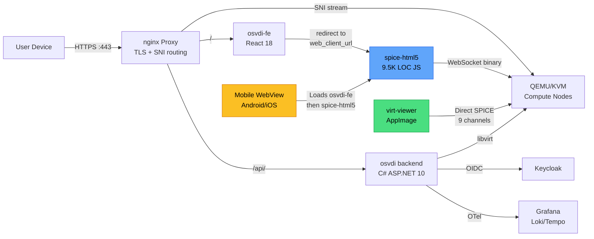
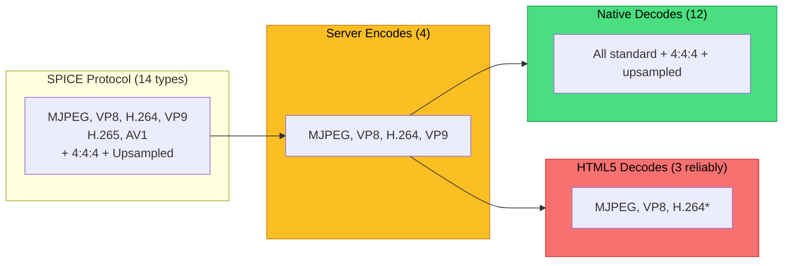

<div class="cover-decoration"></div>

# Evaluation and Improvements of Remote Access in OSVDI

## First Milestone — Comprehensive Evaluation

---

# Table of Contents

<div class="grid grid-cols-2 gap-x-6 gap-y-2 mt-4">
<div class="flex items-center gap-3">
<span class="section-badge section-badge-1" style="width:1.8rem;height:1.8rem;font-size:0.75rem;">1</span>
<span class="text-sm font-medium">Background & Motivation</span>
</div>
<div class="flex items-center gap-3">
<span class="section-badge section-badge-2" style="width:1.8rem;height:1.8rem;font-size:0.75rem;">2</span>
<span class="text-sm font-medium">The OSVDI Ecosystem</span>
</div>
<div class="flex items-center gap-3">
<span class="section-badge section-badge-3" style="width:1.8rem;height:1.8rem;font-size:0.75rem;">3</span>
<span class="text-sm font-medium">Evaluation Approach & Ground Truths</span>
</div>
<div class="flex items-center gap-3">
<span class="section-badge section-badge-4" style="width:1.8rem;height:1.8rem;font-size:0.75rem;">4</span>
<span class="text-sm font-medium">Access Gateway (osvdi-fe)</span>
</div>
<div class="flex items-center gap-3">
<span class="section-badge section-badge-5" style="width:1.8rem;height:1.8rem;font-size:0.75rem;">5</span>
<span class="text-sm font-medium">Native Client (remote-viewer)</span>
</div>
<div class="flex items-center gap-3">
<span class="section-badge section-badge-6" style="width:1.8rem;height:1.8rem;font-size:0.75rem;">6</span>
<span class="text-sm font-medium">Web Client (spice-html5 in Browser)</span>
</div>
<div class="flex items-center gap-3">
<span class="section-badge section-badge-7" style="width:1.8rem;height:1.8rem;font-size:0.75rem;">7</span>
<span class="text-sm font-medium">Mobile Clients (Android & iOS)</span>
</div>
<div class="flex items-center gap-3">
<span class="section-badge section-badge-8" style="width:1.8rem;height:1.8rem;font-size:0.75rem;">8</span>
<span class="text-sm font-medium">Cross-Client Comparison</span>
</div>
<div class="flex items-center gap-3">
<span class="section-badge section-badge-9" style="width:1.8rem;height:1.8rem;font-size:0.75rem;">9</span>
<span class="text-sm font-medium">Verdict: What Works & What Doesn't</span>
</div>
<div class="flex items-center gap-3">
<span class="section-badge section-badge-10" style="width:1.8rem;height:1.8rem;font-size:0.75rem;">10</span>
<span class="text-sm font-medium">Recommendations & Next Steps</span>
</div>
</div>

---
layout: section
---

<div class="section-badge section-badge-1">1</div>

<div class="section-title section-title-1">Background & Motivation</div>
<div class="section-subtitle">Why remote access matters for universities</div>
<div class="section-accent-line section-accent-line-1"></div>

---

# Virtual Desktop Infrastructure

<div class="grid grid-cols-2 gap-6">
<div>

### What is VDI?

- Desktop PCs offered as **remote VMs**
- Users connect via a **Remote Access Protocol** (RAP)
- Goal: replicate local desktop experience

### Why it matters

- **Students**: access uni resources from any device
- **Staff**: work from anywhere, any OS
- **IT**: centralized, secure environments

</div>
<div>

<div class="status-card status-info">

**The Round-Trip Challenge**

> *"Hotel room, smartphone to TV via USB-C, Bluetooth keyboard — do everything from coding to video conferencing."*

Key metric: **round-trip time** — how fast actions show on screen.

</div>

</div>
</div>

---

# Remote Access Protocols

| Protocol | Developer | Open Source | Key Strength |
|----------|-----------|:-----------:|-------------|
| **SPICE** | Red Hat | Yes | Full channel support, open ecosystem |
| **RDP** | Microsoft | FreeRDP | Universal Windows support, mature |
| **ICA/HDX** | Citrix | No | Enterprise optimization |
| **VNC** | Various | Yes | Simple, universal |

<div class="mt-4 grid grid-cols-2 gap-4">
<div class="status-card status-info">

**SPICE** is OSVDI's protocol — QEMU/KVM native, H264 full-video, channels for audio, USB, clipboard, printing.

</div>
<div class="status-card status-success">

**Baselines**: FreeRDP (RDP) and bwLehrpool/Guacamole (VNC) for "what users expect."

</div>
</div>

---
layout: section
---

<div class="section-badge section-badge-2">2</div>

<div class="section-title section-title-2">The OSVDI Ecosystem</div>
<div class="section-subtitle">Architecture, repositories, and protocol internals</div>
<div class="section-accent-line section-accent-line-2"></div>

---

# OSVDI Architecture

<div class="grid grid-cols-2 gap-4">
<div>

### Access Layer
- **React 18** (`osvdi-fe`) + Redux, MUI 7
- Redirects to SPICE HTML5 (not embedded)
- **Keycloak 26** OIDC authentication

### Backend (5 Docker Services)
- **C# ASP.NET Core 10** REST API
- **nginx** proxy (TLS + SPICE routing)
- SQLite DB (desktops, templates, flavors)
- LGTM observability stack
- cAdvisor + OpenTelemetry

</div>
<div>

### Infrastructure
- **QEMU/KVM** hypervisors (libvirt)
- Storage: NFS, Ceph RBD, DNBD3, local
- Proxmox & OpenStack scaffolded

### SPICE Routing (nginx)
- SNI: `{desktop-id}.proxy.example.com`
- Dynamic ACME wildcard TLS
- Connection tracking + OTel tracing

</div>
</div>

---

# Repository Map (18 repos)

<div class="text-xs">

| Repository | Purpose | Tech |
|------------|---------|------|
| **osvdi** | REST API backend + proxy + scripts | C# ASP.NET, Docker Compose |
| **osvdi-fe** | Web frontend (dashboard) | React 18, Redux, MUI, Keycloak |
| **spice-html5** | SPICE JavaScript client (in-browser) | Vanilla JS (~9,500 LOC, 14 yrs old) |
| **spice / spice-gtk** | SPICE server + GTK client library | C (~48K LOC), GStreamer |
| **spice-protocol** | Protocol definitions + headers | C headers, 14 codec types |
| **virt-viewer** | Native desktop SPICE viewer (patched) | C, GTK3, libspice-gtk |
| **MobileSPICEViewer** | Mobile WebView wrappers | Java (Android), Swift (iOS) |
| **MeasurementFramework** | Nanosecond timing (embed in QEMU) | C, clock_gettime |
| **latency-tester** | Visual end-to-end latency tool | Rust + GTK, OCR (Tesseract) |
| **win32-vd\_agent** | Windows guest agent (clipboard, USB, file) | C++, OSVDI fork |

</div>

---

# How It All Connects



---

# SPICE Protocol: Codecs & Reality

`new_video_codecs` branch: **14 codec types** — but server and clients lag behind.

<div class="text-xs">

| Codec | Protocol | Server Encodes | Native Decodes | HTML5 Decodes |
|-------|:--------:|:--------------:|:--------------:|:-------------:|
| **MJPEG** | Yes | Yes | Yes | Yes |
| **VP8** | Yes | Yes | Yes | Yes (MediaSource) |
| **H.264** | Yes + 4:4:4 | Yes (HW+SW) | Yes (HW+SW) | Buggy (WebCodecs) |
| **VP9** | Yes + 4:4:4 | Yes | Yes | **No** |
| **H.265** | Yes + 4:4:4 | **No** | Yes | **No** |
| **AV1** | Yes + 4:4:4 | **No** | Yes | **No** |

</div>

<div class="status-card status-warn mt-1" style="padding:0.5rem 0.75rem;">

Protocol defines **14** codec types, server encodes **4**, HTML5 reliably decodes **3**. The protocol and native client are ahead of the server.

</div>

---

# SPICE Channels (11 Defined)

<div class="grid grid-cols-2 gap-4">
<div>

| Channel | Purpose |
|---------|---------|
| **MAIN** | Session control |
| **DISPLAY** | Video stream |
| **INPUTS** | Keyboard, mouse |
| **CURSOR** | Cursor shape |
| **PLAYBACK** | Audio out |
| **RECORD** | Audio in |

</div>
<div>

| Channel | Purpose |
|---------|---------|
| **TUNNEL** | Network tunneling |
| **SMARTCARD** | Smart card auth |
| **USBREDIR** | USB redirection |
| **PORT** | Generic data |
| **WEBDAV** | File sharing |

</div>
</div>

<div class="status-card status-critical mt-2">

**Native client (spice-gtk):** implements **all 9 usable** channels.
**HTML5 client:** implements **6/11** channels. **Mobile apps:** inherit HTML5 limitations + add their own.

</div>

---

# DMA-BUF Zero-Copy Encoding (OSVDI New)

<div class="grid grid-cols-2 gap-4">
<div>

### Traditional (QXL)

Guest GPU → draw cmds → CPU rasterize → encode → network

**Latency: 50–150ms**

</div>
<div>

### GL_DRAW (OSVDI)

Guest GPU → DMA-BUF → GStreamer HW encode → network

**Latency: 6–50ms**

</div>
</div>

<div class="status-card status-success mt-2">

Adaptive bitrate 128 Kbps–20 Mbps. Client feedback loop adjusts quality. 60+ OSVDI commits since Jan 2025. Intel GPU auto-detected; AMD/NVIDIA paths not yet implemented.

</div>

---
layout: section
---

<div class="section-badge section-badge-3">3</div>

<div class="section-title section-title-3">Evaluation Approach</div>
<div class="section-subtitle">Methodology, test matrix, and two ground truths</div>
<div class="section-accent-line section-accent-line-3"></div>

---

# Two Ground Truths

<div class="grid grid-cols-2 gap-6">
<div>

<div class="status-card status-info">

### Ground Truth 1: RDP User

**What would a former user of RDP expect?**

- FreeRDP / MS Remote Desktop: full channels, smooth experience, auto-reconnect
- bwLehrpool (Guacamole): VNC-based, no audio, no file access — but simple and reliable
- Expectation: everything "just works" on any device

</div>

</div>
<div>

<div class="status-card status-success">

### Ground Truth 2: SPICE Native User

**What would a SPICE user familiar with the native client expect in web/mobile?**

- `remote-viewer`: all 9 channels, HW-accelerated decode, full keyboard
- Expectation: web/mobile variants should approach native quality
- Reality: significant gap

</div>

</div>
</div>

---

# What Was Evaluated

<div class="grid grid-cols-2 gap-6">
<div>

### Access Variants Tested

| Variant | Platform |
|---------|----------|
| Native client (`remote-viewer`) | Linux (Debian) |
| Browser (SPICE HTML5) | Chrome, Firefox, Safari |
| Android WebView wrapper | Android phone/tablet |
| iOS WebView wrapper | iPhone/iPad |

### Evaluation Perspective

Like the **responsible person who procured this development** — evaluating each module before accepting delivery.

</div>
<div>

### Aspects Evaluated

- Login and access gateway usability
- Ease of use with Windows / Linux VMs
- Keyboard, mouse, modifier keys
- Channel completeness per client
- Code quality and critical bugs
- Comparison with RDP/Guacamole baseline
- Known issues (GitLab) vs new findings

</div>
</div>

---
layout: section
---

<div class="section-badge section-badge-4">4</div>

<div class="section-title section-title-4">Access Gateway (osvdi-fe)</div>
<div class="section-subtitle">The first thing every user interacts with</div>
<div class="section-accent-line section-accent-line-4"></div>

---

# Access Gateway: What Works

<div class="grid grid-cols-2 gap-6">
<div>

### Authentication
- Keycloak 26 OIDC integration — **works**
- Login redirects handled smoothly
- Admin vs user role distinction

### Desktop Management
- Create / Start / Stop / Kill / Destroy — **works**
- Grid view + Table view with filtering
- Template + flavor selection
- Real-time SSE updates (no page refresh)

</div>
<div>

### SPICE Launch
- Click "Play" → checks VM state → launches
- Toggle: HTML5 client vs native (`spice://` URI)
- URL construction: `web_client_url + desktop.url`
- **Redirects** browser — does NOT embed SPICE

### Updated Interface
- `dev.osvdi.uni-freiburg.de` has improvements
- Not yet pushed to demo servers

</div>
</div>

---

# Access Gateway: Issues Found

<div class="grid grid-cols-2 gap-4">
<div>

### Security Concerns

| Issue | Severity |
|-------|----------|
| SSE token passed as **URL query parameter** | High |
| No session timeout warning UI | Medium |
| No retry/backoff on SSE reconnection | Medium |
| Backend binds SPICE on `0.0.0.0` | Medium |

<div class="status-card status-warn mt-2" style="padding:0.5rem 0.75rem;">

SSE `?access_token=...` in URL is visible in logs, browser history, and referrer headers.

</div>

</div>
<div>

### UX Gaps

| Issue | Severity |
|-------|----------|
| SPICE redirect (not embedded) is jarring | Medium |
| No file transfer UI in frontend | High |
| No clipboard UI in frontend | High |
| Hardcoded OS icons (TODO in code) | Low |
| SSE reconnection instability (3+ fix commits) | Medium |

</div>
</div>

---

# Access Gateway: RDP Baseline Comparison

<div class="text-xs">

| Aspect | FreeRDP / MS RD | bwLehrpool (Guacamole) | OSVDI Gateway |
|--------|:-:|:-:|:-:|
| Single-click connect | Yes | Yes | Needs VM start first |
| Credential storage | Yes | Browser | Keycloak SSO |
| Multi-factor auth | Yes (AD) | No | Keycloak (configurable) |
| Embedded remote view | Yes | Yes | **No — redirects away** |
| Mobile-friendly UI | RD Client app | Responsive web | Responsive web |

</div>

<div class="status-card status-info mt-2">

The redirect-based launch means users leave the gateway to enter a SPICE session. RDP and Guacamole embed the remote view — a more seamless experience.

</div>

---
layout: section
---

<div class="section-badge section-badge-5">5</div>

<div class="section-title section-title-5">Native Client (remote-viewer)</div>
<div class="section-subtitle">The SPICE ground truth — what works fully</div>
<div class="section-accent-line section-accent-line-5"></div>

---

# Native Client: What Works

<div class="grid grid-cols-2 gap-4">
<div>

### Channels Verified

| Channel | Status |
|---------|--------|
| Display (12 codecs, HW accel) | **Works** |
| Keyboard + mouse (PC XT scancodes) | **Works** |
| Audio bidirectional (Opus) | **Works** |
| Clipboard (GTK integration) | **Works** |
| USB redirect (15 xHCI ports) | **Works** |
| Smartcard | **Works** |

</div>
<div>

### OSVDI Patches
- **Runtime codec selection UI** — switch codecs live
- **AppImage build pipeline** — bundles GStreamer + libva
- Removed decoding queue → atomic counter (perf win)
- `alignment=au` — reduces buffering (lower latency)
- Wayland improvements, frame metadata

### Distribution
- Pre-built **AppImage** (x86_64 Linux only) via GitLab CI
- URI handler: `spice://`, `spice+tls://`

</div>
</div>

---

# Native Client: What's Missing

<div class="text-xs">

| Gap | Status | Impact |
|-----|--------|--------|
| **File transfer (WebDAV)** | Code complete but VM template **missing chardev** | High — one config line fix |
| **Printing** | Not implemented anywhere in stack | Medium |
| **Multi-monitor** | FIXME — only primary surface 0 | High for desktop users |
| **macOS / Windows builds** | Only Linux AppImage exists | High — limits reach |
| **Wayland support** | Partial, experimental | Medium |

</div>

<div class="status-card status-success mt-2">

**File transfer** is the closest quick win — adding `org.spice-space.webdav.0` to the VM template chardev would enable it. Code is complete on both server + guest agent sides.

</div>

---

# Native Client: RDP Comparison

<div class="grid grid-cols-2 gap-4">
<div>

### Where OSVDI Matches FreeRDP

| Feature | FreeRDP | OSVDI |
|---------|:-------:|:-----:|
| Video (HW decode) | Yes | Yes |
| Audio (bidirectional) | Yes | Yes |
| Clipboard | Yes | Yes |
| USB redirect | Yes | Yes |

</div>
<div>

### Where OSVDI Falls Short

| Feature | FreeRDP | OSVDI |
|---------|:-------:|:-----:|
| File transfer | Yes | **Almost** (chardev) |
| Printing | Yes | **No** |
| Multi-monitor | Yes | **Partial** |
| Cross-platform | Win/Mac/Linux | **Linux only** |
| Auto-reconnect | Yes | **No** |

</div>
</div>

<div class="status-card status-warn mt-2">

Strong core but not at FreeRDP parity. Biggest gaps: **printing**, **multi-monitor**, **cross-platform builds**.

</div>

---
layout: section
---

<div class="section-badge section-badge-6">6</div>

<div class="section-title section-title-6">Web Client (spice-html5)</div>
<div class="section-subtitle">A 14-year-old codebase with critical bugs</div>
<div class="section-accent-line section-accent-line-6"></div>

---

# spice-html5: Overview

<div class="grid grid-cols-2 gap-4">
<div>

- First commit: **June 2012** — freedesktop.org
- **~9,500 LOC** pure JS, zero npm deps
- **WebSocket** binary subprotocol
- Branch: `cursor_fix` (BGRA→RGBA fix)

**Channels:** 6/11 — MAIN, DISPLAY, INPUTS, CURSOR, PLAYBACK, PORT

**Missing:** RECORD, SMARTCARD, USBREDIR, WEBDAV, TUNNEL

</div>
<div>

### Video Codecs Supported

| Codec | Method |
|-------|--------|
| QUIC | Native JS (CPU bottleneck) |
| MJPEG | Canvas Image API |
| VP8 | MediaSource / WebM |
| **H.264** | **WebCodecs** (HW accel) |

<div class="status-card status-warn" style="padding:0.5rem 0.75rem;">

QUIC in JS is CPU-bound. H.264 via WebCodecs offloads to GPU but has critical bugs.

</div>

</div>
</div>

---

# spice-html5: Critical Bugs Found

<div class="text-xs">

| Bug | Severity | Location | New? |
|-----|----------|----------|:----:|
| H.264 resolution **hardcoded 1920x1080** | Critical | `display.js:1210` | Yes |
| VideoDecoder **never closed** (memory leak) | High | `display.js:1196` | Yes |
| **No WebSocket reconnection** on disconnect | High | `spiceconn.js:88` | Yes |
| File transfer is **UI-only**, no actual upload | High | `filexfer.js` | Yes |
| Modifier key state **desyncs** on focus loss | Medium | `inputs.js:32` | Yes |
| **No dead key / IME** for non-Latin input | Medium | `code_to_scancode.js` | Yes |
| Audio timestamp **hack** for Firefox | Medium | `playback.js:105` | Yes |
| Image cache **unbounded** (no eviction) | Medium | `display.js:729` | Yes |

</div>

<div class="status-card status-critical mt-1" style="padding:0.4rem 0.75rem;">

All bugs above are **new findings** — not tracked in any existing GitLab issue.

</div>

---

# spice-html5: Browser Limitations

<div class="grid grid-cols-2 gap-6">
<div>

### Inherent Browser Constraints

- Extra latency (event loop, buffering, compositor)
- Keyboard limited (ESC, Alt, F-keys intercepted)
- No USB, no printing, no file system access
- WebSocket only (no raw TCP)

</div>
<div>

### What a Native SPICE User Will Notice

- **Missing channels:** USB, file transfer, printing, record, smartcard
- **Keyboard quirks:** modifier desync, no dead keys
- **No reconnection:** network blip = session lost
- **Non-1080p broken:** H.264 hardcoded to 1920x1080

</div>
</div>

<div class="status-card status-warn mt-2">

Browsers add convenience (no install) at the cost of control. For thin-client hardware, the browser is the bottleneck — "a software monster just to decode a video."

</div>

---

# HTML5 Rewrite Status

<div class="status-card status-critical">

**Issue #15** in osvdi-fe: "Rewrite the HTML5 SPICE transport"

- Assigned to Rafael Gieschke — **due May 15, 2026 (past due)**
- Milestone: MVP Extended → September 30, 2026
- **No separate repo exists.** Only "HACK:" patches on 14-year-old code
- Current state: stopgap patches (WebCodecs H.264, cursor fix, auto-disconnect)

</div>

<div class="status-card status-info mt-2">

**The bugs found in this evaluation become requirements for the rewrite** — not things to fix on 14-year-old code. Investing effort in the old client risks duplication when the rewrite lands.

</div>

---
layout: section
---

<div class="section-badge section-badge-7">7</div>

<div class="section-title section-title-7">Mobile Clients</div>
<div class="section-subtitle">Android & iOS — thin WebView wrappers over spice-html5</div>
<div class="section-accent-line section-accent-line-7"></div>

---

# Mobile Architecture

<div class="grid grid-cols-2 gap-6">
<div>

```
┌──────────────────────┐
│ Native App Shell     │
│ (Java or Swift)      │
│ ~1,300 LOC each      │
│ ┌──────────────────┐ │
│ │ WebView          │ │
│ │ spice-html5      │ │
│ │ + JS bridges     │ │
│ └──────────────────┘ │
│ Overlay: 4 buttons   │
└──────────────────────┘
```

Inherits **all** spice-html5 limitations plus mobile-specific issues.

</div>
<div>

### What Works (Both Platforms)

| Feature | Status |
|---------|--------|
| SPICE session loading | Working |
| Touch-to-mouse (drag) | Working |
| Long-press drag / right-click | Working |
| Virtual keyboard (basic chars) | Working |
| Overlay controls | Working |

Only `INTERNET` permission. No clipboard, audio, USB, or file transfer channels.

</div>
</div>

---

# Mobile: Android Issues

<div class="grid grid-cols-2 gap-4">
<div>

| Issue | Severity |
|-------|----------|
| Screen **cropped** — content unreachable | Critical |
| **No cursor visible** anywhere | Critical |
| **No back button** — trapped in session | High |
| Pinch-to-zoom **broken** (TODO in code) | High |
| No modifier keys (Ctrl, Alt, Shift) | High |
| No scroll gesture | High |
| All config **hardcoded** (no settings) | Medium |
| Double-tap tracked but **never dispatched** | Medium |

</div>
<div>

### Hardcoded Config

| Parameter | Value |
|-----------|-------|
| Page zoom | `0.62f` |
| Cursor speed | `2.0` |
| Cursor smoothing | `0.6` LERP |
| Touch mode | Always on |

All marked `// TODO: SharedPreferences`

</div>
</div>

---

# Mobile: iOS Issues

<div class="grid grid-cols-2 gap-4">
<div>

| Issue | Severity |
|-------|----------|
| **Taskbar cropped** at bottom | High |
| Gray bars on sides (wasted space) | Medium |
| **Infinite loading** after screen lock | High |
| Forced landscape only | Medium |
| No modifier keys (Ctrl, Alt, Shift) | High |
| No scroll gesture | High |

</div>
<div>

### Screen Lock = Session Death

1. User locks phone during session
2. WKWebView **loses state** when suspended
3. Unlock → stuck on "Loading..." forever
4. Must **force-quit** and relaunch

**Industry standard:** auto-reconnect on resume.

### Two Separate Codebases

Java (Android) vs Swift (iOS), Apache 2.0 vs GPLv2, 15 languages vs English-only. Every fix applied twice. **This doesn't scale.**

</div>
</div>

---

# Mobile: Both Platforms — Tap Doesn't Move Cursor

```
Expected:                    Actual:

 Tap icon                     Tap icon
 → cursor JUMPS there        → click at CURRENT cursor pos
 → click registers           → must DRAG to target first
```

<div class="status-card status-critical mt-4">

**Every interaction requires dragging to the target first.** In every competing app (TeamViewer, AnyDesk, RustDesk, MS RD Client), tapping moves the cursor there instantly.

</div>

<div class="status-card status-info mt-2">

**Root cause:** `touchToMouseScript.js` only emits `mousemove` on drag, not on tap.
**Fix:** Send `mousemove` to tap coordinates before click dispatch.

</div>

---
layout: section
---

<div class="section-badge section-badge-8">8</div>

<div class="section-title section-title-8">Cross-Client Comparison</div>
<div class="section-subtitle">Channels, keyboard, and codecs across all access methods</div>
<div class="section-accent-line section-accent-line-8"></div>

---

# Channel Support: Core Channels

<div class="text-xs">

| Channel | Native | Browser | Mobile | FreeRDP |
|---------|:------:|:-------:|:------:|:-------:|
| **Video** | 12 codecs, HW | 3 codecs (buggy) | Via browser | Full |
| **Audio out** | Opus | Opus (hack) | **None** | Full |
| **Audio in** | Opus | **None** | **None** | Full |
| **Clipboard** | Full | **Partial** | **None** | Full |

</div>

<div class="status-card status-info mt-2">

Core media channels work on native. Browser loses audio input. Mobile has **no audio or clipboard at all**.

</div>

---

# Channel Support: Advanced Channels

<div class="text-xs">

| Channel | Native | Browser | Mobile | FreeRDP |
|---------|:------:|:-------:|:------:|:-------:|
| **USB redirect** | Full (15 ports) | **Impossible** | **Impossible** | Yes |
| **File transfer** | Almost (chardev) | **UI only** | **None** | Yes |
| **Printing** | **None** | **None** | **None** | Yes |
| **Multi-monitor** | **Partial** | **None** | **None** | Yes |
| **Smartcard** | Full | **None** | **None** | Yes |

</div>

<div class="status-card status-critical mt-2">

The further from native, the more channels lost. USB, printing, smartcard are **impossible** via browser/WebView. Mobile = video + basic input only.

</div>

---

# Keyboard & Input Across Clients

<div class="text-xs">

| Input Feature | Native | Browser | Mobile | FreeRDP |
|---------------|:------:|:-------:|:------:|:-------:|
| Full PC keyboard | Yes | Mostly | Basic chars | Yes |
| Modifiers (Ctrl, Alt, Shift) | Yes | Yes (desync) | **Missing** | Yes |
| Function keys (F1–F12) | Yes | Partial | **Missing** | Yes |
| Dead keys / IME | Yes | **No** | **No** | Yes |
| Esc key | Yes | Fullscreen conflict | **Missing** | Yes |
| Mouse scroll | Yes | Yes | **Missing** | Yes |
| Right-click | Yes | Yes | Two-finger tap | Yes |

</div>

<div class="status-card status-warn mt-1" style="padding:0.4rem 0.75rem;">

**The keyboard gap is the biggest usability blocker after video.** Without Ctrl, Alt, Shift, and F-keys, users cannot copy/paste, switch windows, or use terminal shortcuts.

</div>

---

# Codec Pipeline: Server → Client



<div class="status-card status-warn mt-2">

**The bottleneck is the server** (only 4 codecs encoded), not the protocol. And the HTML5 client further narrows to 3 — with H.264 buggy (hardcoded 1920x1080). Native client is the only path to full codec support today.

</div>

---
layout: section
---

<div class="section-badge section-badge-9">9</div>

<div class="section-title section-title-9">Verdict</div>
<div class="section-subtitle">What works, what doesn't, and what's new vs. known</div>
<div class="section-accent-line section-accent-line-9"></div>

---

# What's Working Well

<div class="grid grid-cols-2 gap-4">
<div>

### Server & Protocol
- DMA-BUF zero-copy encoding pipeline — major achievement
- Adaptive bitrate (128K–20Mbps) with client feedback
- 14 codec types defined in protocol (future-proof)
- SPICE routing via nginx SNI — elegant

### Native Client
- All 9 usable channels implemented
- HW-accelerated decode (12 codecs)
- Runtime codec switching UI
- AppImage build pipeline working

</div>
<div>

### Access Gateway
- Keycloak OIDC authentication
- Real-time SSE desktop updates
- Desktop management (CRUD) works
- Admin/user role distinction

### Infrastructure
- Full observability (OTel + Grafana)
- Measurement tools ready (nanosecond precision)
- Guest agent (clipboard, USB, file transfer code complete)
- Multiple storage backends supported

</div>
</div>

---

# What's Not Working

<div class="grid grid-cols-2 gap-4">
<div>

### Critical (Blocks Basic Usage)

- **spice-html5:** H.264 hardcoded 1920x1080
- **spice-html5:** No reconnection on disconnect
- **spice-html5:** File transfer is fake (UI only)
- **Mobile:** Screen cropped / taskbar cut off
- **Mobile:** No cursor visible (Android)
- **Mobile:** No modifier keys on either platform
- **Mobile:** iOS session dies on screen lock
- **Gateway:** SSE token exposed in URL

</div>
<div>

### Significant (Blocks Real Work)

- **spice-html5:** Modifier key desync on focus loss
- **spice-html5:** No dead key / IME input
- **Server:** Only 4 of 14 codecs encoded
- **Server:** No H.265/AV1 encoding despite protocol support
- **Native:** File transfer not wired (missing chardev)
- **Native:** Multi-monitor limited to surface 0
- **Native:** No macOS / Windows builds
- **Gateway:** No session timeout warning
- **Mobile:** No scroll, zoom broken, no settings

</div>
</div>

---

# Already Tracked in GitLab

| Issue | Assignee | Status |
|-------|----------|--------|
| Mouse pointer offset | Rafael | In progress |
| Resizing issue | Rafael | In progress |
| HTML5 SPICE rewrite (Issue #15) | Rafael | Past due (May 15) |
| Frontend UX improvements | Isabela | Active (dev server) |
| Various osvdi-fe work items | Team | Open |

<div class="status-card status-info mt-2">

These are **not repeated** in detail — elaborated where relevant in the per-client sections. The presentation focuses on **new findings** discovered during this evaluation.

</div>

---

# New Findings (This Evaluation)

<div class="grid grid-cols-2 gap-4">
<div>

### spice-html5

| Finding | Severity |
|---------|----------|
| H.264 hardcoded 1920x1080 | Critical |
| VideoDecoder memory leak | High |
| No WebSocket reconnection | High |
| File transfer is fake (UI only) | High |
| Modifier key desync | Medium |

</div>
<div>

### Backend, Gateway & Mobile

| Finding | Severity |
|---------|----------|
| SSE token exposed in URL | High |
| SPICE binds `0.0.0.0` | Medium |
| VM template missing chardev | High |
| Codec mismatch (14→4→3) | High |
| Mobile UX (crop, cursor, KB) | Critical |

</div>
</div>

<div class="status-card status-critical mt-2">

**10 new findings** across the stack — most concentrated in spice-html5, the component shared by browser and mobile clients.

</div>

---
layout: section
---

<div class="section-badge section-badge-10">10</div>

<div class="section-title section-title-10">Recommendations & Next Steps</div>
<div class="section-subtitle">What needs to be done and in what order</div>
<div class="section-accent-line section-accent-line-10"></div>

---

# Priority 1: Quick Wins (Low Effort, High Impact)

<div class="text-xs">

| Action | Component | Effort | Impact |
|--------|-----------|--------|--------|
| Add WebDAV chardev to VM template | Infra | **1 line** | Enables file transfer (native) |
| Move SSE token to header/cookie | osvdi-fe | Low | Fixes security exposure |
| Add back button to Android | Mobile | Low | Users can exit sessions |
| Send `mousemove` before tap click | JS bridge | Low | Tap-to-click on mobile |
| Document spice-html5 bugs as **rewrite requirements** | Documentation | Low | Ensures rewrite addresses them |

</div>

<div class="status-card status-success mt-2">

These fixes target components that the HTML5 rewrite **won't replace** — infrastructure, gateway, and mobile wrappers. The spice-html5 bugs become input for Rafael's rewrite, not tasks to fix on 14-year-old code.

</div>

---

# Priority 2: Targeted Improvements

<div class="grid grid-cols-2 gap-4">
<div>

### HTML5 Rewrite (Rafael)
Feed these findings as **requirements**:
- WebSocket reconnection logic
- Modifier key sync on focus loss
- Dead key / IME support
- Real file transfer (not UI-only)
- Image cache eviction
- Support non-1080p resolutions

### Access Gateway
- Session timeout warning
- SSE reconnection with backoff
- Embed SPICE view (don't redirect)
- Clipboard / file transfer UI

</div>
<div>

### Native Client
- Wire WebDAV chardev in templates
- Multi-monitor beyond surface 0
- Adaptive quality UI (not just env var)
- macOS / Windows build pipeline

### Mobile Apps
- Fit-to-screen scaling
- Visible cursor (Android)
- Modifier key bar overlay
- Fix pinch-to-zoom
- iOS: session survive screen lock

</div>
</div>

---

# The Native vs Browser Question

<div class="grid grid-cols-2 gap-6">
<div>

### Why Not Ignore Native Clients?

- Browser adds latency layer (buffering, event loop, compositor)
- Browser limits keyboard (ESC, Alt, F-keys intercepted)
- Controlling decode behavior in browsers is difficult
- **Thin clients** (long-lived, low-power hardware) need lightweight rendering
- Channels (USB, printing, security tokens) require native access
- The planned HTML5 rewrite is a clean-slate opportunity

</div>
<div>

### Why Browser Still Matters

- Zero install — immediate access
- Cross-platform by default
- Gateway UI already web-based
- Sufficient for casual / light use
- Students accessing from any device

### The Balance

Native for **primary work** (performance, full channels). Browser for **convenience access** (quick checks, any device).

</div>
</div>

---

# Roadmap


---

# Coordination & Dependencies

| Who | Working On | Dependency |
|-----|-----------|------------|
| **Rafael** | SPICE HTML5 rewrite (past due) | Rewrite may change JS APIs — mobile bridges affected |
| **Isabela** | Frontend / UX (osvdi-fe) | Gateway improvements need alignment |
| **This project** | Evaluation + improvements across stack | HTML5 fixes depend on rewrite decision |

<div class="status-card status-warn mt-4">

**Key dependency:** Rafael's rewrite will replace the current spice-html5. The bugs found here should feed into the rewrite as requirements. Meanwhile, **improvements to gateway, native client, and mobile wrappers** are independent and can proceed now.

</div>

---

# Decision Framework

| If... | Then... |
|-------|---------|
| Quick wins resolve major pain | Ship infra/gateway/mobile fixes now |
| HTML5 rewrite delivers on time (Sept) | Feed bugs as requirements, don't fix old code |
| HTML5 rewrite slips significantly | Reassess — may need stopgap fixes |
| WebView latency < 80ms | Mobile WebView approach viable; invest in channels |
| WebView latency unacceptable | Native rendering (FFI to libspice-gtk) needed |
| USB/printing/security tokens required | Must go native — impossible via browser |
| Two mobile codebases diverge further | Unify via cross-platform framework |
| Thin client hardware can't run browser | Native client is the only option |

---
layout: center
class: text-center
---

# Live Demo

<div class="grid grid-cols-4 gap-3 mt-6">
<div class="p-3 rounded-xl bg-cyan-50 dark:bg-cyan-950 border border-cyan-200 dark:border-cyan-800">
<div class="text-xl mb-1">&#127760;</div>
<div class="font-bold text-cyan-700 dark:text-cyan-300 text-sm">Gateway</div>
<div class="text-xs opacity-50">osvdi-fe</div>
</div>
<div class="p-3 rounded-xl bg-green-50 dark:bg-green-950 border border-green-200 dark:border-green-800">
<div class="text-xl mb-1">&#128421;</div>
<div class="font-bold text-green-700 dark:text-green-300 text-sm">Native</div>
<div class="text-xs opacity-50">remote-viewer</div>
</div>
<div class="p-3 rounded-xl bg-blue-50 dark:bg-blue-950 border border-blue-200 dark:border-blue-800">
<div class="text-xl mb-1">&#128187;</div>
<div class="font-bold text-blue-700 dark:text-blue-300 text-sm">Browser</div>
<div class="text-xs opacity-50">spice-html5</div>
</div>
<div class="p-3 rounded-xl bg-pink-50 dark:bg-pink-950 border border-pink-200 dark:border-pink-800">
<div class="text-xl mb-1">&#128241;</div>
<div class="font-bold text-pink-700 dark:text-pink-300 text-sm">Mobile</div>
<div class="text-xs opacity-50">Android / iOS</div>
</div>
</div>

<div class="mt-4 text-sm opacity-60">

Demonstrate: gateway login → VM launch → native session → browser session → mobile session

Show: keyboard mapping, channel differences, bugs in action

</div>

---
layout: center
class: text-center
---

# Discussion & Next Steps

<div class="grid grid-cols-2 gap-4 mt-4 text-left">
<div class="p-4 rounded-lg bg-red-50 dark:bg-red-950 border-l-4 border-red-500">
<div class="font-bold text-red-800 dark:text-red-200">Quick Wins</div>
<div class="text-sm mt-1 opacity-80">Ship the 6 low-effort fixes immediately?</div>
</div>
<div class="p-4 rounded-lg bg-blue-50 dark:bg-blue-950 border-l-4 border-blue-500">
<div class="font-bold text-blue-800 dark:text-blue-200">HTML5 Rewrite</div>
<div class="text-sm mt-1 opacity-80">Fix bugs now or wait for Rafael's rewrite?</div>
</div>
<div class="p-4 rounded-lg bg-purple-50 dark:bg-purple-950 border-l-4 border-purple-500">
<div class="font-bold text-purple-800 dark:text-purple-200">Performance</div>
<div class="text-sm mt-1 opacity-80">Plan benchmarking: native vs browser vs mobile latency</div>
</div>
<div class="p-4 rounded-lg bg-teal-50 dark:bg-teal-950 border-l-4 border-teal-500">
<div class="font-bold text-teal-800 dark:text-teal-200">Architecture</div>
<div class="text-sm mt-1 opacity-80">Native for work, browser for convenience — agree on strategy?</div>
</div>
</div>

---
layout: center
class: text-center
---

<div class="thankyou-title">Thank You</div>

<div class="mt-2">
<div class="thankyou-author">Bishwajeet Parhi</div>
<div class="thankyou-affiliation">Study Project — eScience Department, University of Freiburg</div>
</div>

<div class="thankyou-links text-sm">

[report.md](../report.md) -- Main evaluation | [accessibility-evaluation.md](../accessibility-evaluation.md) -- Industry comparison | [cross-platform-strategy.md](../cross-platform-strategy.md) -- Cross-platform analysis

</div>
