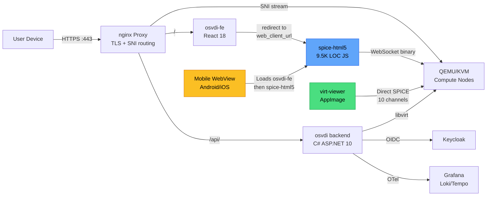
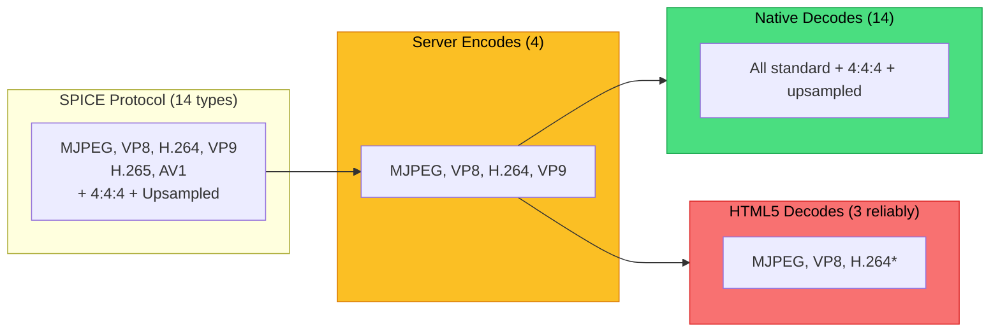

<div class="cover-decoration"></div>

<div class="mt-4">
<span class="text-cyan-600 dark:text-cyan-400 text-sm font-mono tracking-widest uppercase">Study Project — eScience Department</span>
</div>

# Evaluation and Improvements of<br/>Remote Access in OSVDI

<div class="mt-2 text-xl text-gray-500 dark:text-gray-300 font-light">First Milestone — Comprehensive Evaluation</div>

<div class="mt-4 text-sm font-semibold text-gray-600 dark:text-gray-300">Bishwajeet Parhi</div>
<div class="text-xs text-gray-400 dark:text-gray-400">eScience Department, Computer Center, University of Freiburg</div>


---

# Table of Contents

<div class="grid grid-cols-2 gap-x-6 gap-y-2 mt-4">
<div class="flex items-center gap-3">
<span class="section-badge section-badge-1" style="width:1.8rem;height:1.8rem;font-size:0.75rem;">1</span>
<span class="text-sm font-medium">Background & Motivation</span>
</div>
<div class="flex items-center gap-3">
<span class="section-badge section-badge-2" style="width:1.8rem;height:1.8rem;font-size:0.75rem;">2</span>
<span class="text-sm font-medium">The OSVDI Ecosystem</span>
</div>
<div class="flex items-center gap-3">
<span class="section-badge section-badge-3" style="width:1.8rem;height:1.8rem;font-size:0.75rem;">3</span>
<span class="text-sm font-medium">Evaluation Approach & Ground Truths</span>
</div>
<div class="flex items-center gap-3">
<span class="section-badge section-badge-4" style="width:1.8rem;height:1.8rem;font-size:0.75rem;">4</span>
<span class="text-sm font-medium">Access Gateway (osvdi-fe)</span>
</div>
<div class="flex items-center gap-3">
<span class="section-badge section-badge-5" style="width:1.8rem;height:1.8rem;font-size:0.75rem;">5</span>
<span class="text-sm font-medium">Native Client (remote-viewer)</span>
</div>
<div class="flex items-center gap-3">
<span class="section-badge section-badge-6" style="width:1.8rem;height:1.8rem;font-size:0.75rem;">6</span>
<span class="text-sm font-medium">Web Client (spice-html5 in Browser)</span>
</div>
<div class="flex items-center gap-3">
<span class="section-badge section-badge-7" style="width:1.8rem;height:1.8rem;font-size:0.75rem;">7</span>
<span class="text-sm font-medium">Mobile Clients (Android & iOS)</span>
</div>
<div class="flex items-center gap-3">
<span class="section-badge section-badge-8" style="width:1.8rem;height:1.8rem;font-size:0.75rem;">8</span>
<span class="text-sm font-medium">Cross-Client Comparison</span>
</div>
<div class="flex items-center gap-3">
<span class="section-badge section-badge-9" style="width:1.8rem;height:1.8rem;font-size:0.75rem;">9</span>
<span class="text-sm font-medium">Assessment: What Works & What Doesn't</span>
</div>
<div class="flex items-center gap-3">
<span class="section-badge section-badge-10" style="width:1.8rem;height:1.8rem;font-size:0.75rem;">10</span>
<span class="text-sm font-medium">Recommendations & Next Steps</span>
</div>
</div>

---
layout: section
---

<div class="section-badge section-badge-1">1</div>

<div class="section-title section-title-1">Background & Motivation</div>
<div class="section-subtitle">Why remote access matters for universities</div>
<div class="section-accent-line section-accent-line-1"></div>


<span class="absolute bottom-2 right-8 text-xs opacity-40">HTTP 100 — Continue</span>

---

# Virtual Desktop Infrastructure

<div class="grid grid-cols-2 gap-6">
<div>

### What is VDI?


- Desktop PCs offered as **remote VMs**
- Users connect via a **Remote Access Protocol** (RAP)
- Goal: replicate local desktop experience


### Why it matters


- **Students**: access uni resources from any device
- **Staff**: work from anywhere, any OS
- **IT**: centralized, secure environments


</div>
<div>

<div class="status-card status-info">

**The Challenge**

> *"Hotel room, smartphone to TV via USB-C, Bluetooth keyboard — do everything from coding to video conferencing."*

Two dimensions: **round-trip time** (how fast actions show) and **usability** (a non-tech user should handle remote sessions as naturally as local ones — the workflow until the desktop appears matters as much as latency).

</div>

</div>
</div>

---

# Remote Access Protocols

| Protocol | Developer | Open Source | Key Strength |
|----------|-----------|:-----------:|-------------|
| **SPICE** | Red Hat | Yes | Full channel support, open ecosystem |
| **RDP** | Microsoft | FreeRDP | Universal Windows support, mature |
| **ICA/HDX** | Citrix | No | Enterprise optimization |
| **VNC** | Various | Yes | Simple, universal |

<div class="mt-4 grid grid-cols-2 gap-4">
<div v-click class="status-card status-info">

**SPICE** is OSVDI's protocol — QEMU/KVM native, multi-codec video streaming, channels for audio, USB, clipboard, printing.

</div>
<div v-click class="status-card status-success">

**Baselines**: FreeRDP (RDP) and bwLehrpool/Guacamole (VNC) for "what users expect."

</div>
</div>

<!--
QEMU/KVM = open-source virtualization stack. QEMU emulates hardware, KVM (Linux kernel module) provides hardware acceleration. SPICE was built specifically for this stack. bwLehrpool uses VNC via Guacamole — simpler but fewer features.
-->

---
layout: section
---

<div class="section-badge section-badge-2">2</div>

<div class="section-title section-title-2">The OSVDI Ecosystem</div>
<div class="section-subtitle">Architecture, repositories, and protocol internals</div>
<div class="section-accent-line section-accent-line-2"></div>


<span class="absolute bottom-2 right-8 text-xs opacity-40">HTTP 200 — OK</span>

---

# OSVDI Architecture

<div class="grid grid-cols-2 gap-4">
<div>

### Access Layer


- **React 18** (`osvdi-fe`) + Redux, MUI 7
- Redirects to SPICE HTML5 (not embedded)
- **Keycloak 26** OIDC authentication


### Backend (5 Docker Services)


- **C# ASP.NET Core 10** REST API
- **nginx** proxy (TLS + SPICE routing)
- SQLite DB, LGTM observability, OpenTelemetry


</div>
<div>

### Infrastructure


- **QEMU/KVM** hypervisors (libvirt)
- Storage: NFS, Ceph RBD, DNBD3, local
- Proxmox & OpenStack scaffolded


### SPICE Routing (nginx)


- SNI: `{desktop-id}.proxy.example.com`
- Dynamic ACME wildcard TLS
- Connection tracking + OTel tracing


</div>
</div>

<!--
LGTM = Loki (logs), Grafana (dashboards), Tempo (traces), Mimir (metrics). Full observability stack by Grafana Labs. OTel = OpenTelemetry, vendor-neutral telemetry standard.
-->

---

# Repository Map (18 repos)

<div class="text-xs">

| Repository | Purpose | Tech |
|------------|---------|------|
| **osvdi** | REST API backend + proxy + scripts | C# ASP.NET, Docker Compose |
| **osvdi-fe** | Web frontend (dashboard) | React 18, Redux, MUI, Keycloak |
| **spice-html5** | SPICE JavaScript client (in-browser) | Vanilla JS (~9,500 LOC, 14 yrs old) |
| **spice / spice-gtk** | SPICE server + GTK client library | C (~48K LOC), GStreamer |
| **spice-protocol** | Protocol definitions + headers | C headers, 14 codec types |
| **virt-viewer** | Native desktop SPICE viewer (patched) | C, GTK3, libspice-gtk |
| **MobileSPICEViewer** | Mobile WebView wrappers | Java (Android), Swift (iOS) |
| **MeasurementFramework** | Nanosecond timing (embed in QEMU) | C, clock_gettime |
| **latency-tester** | Visual end-to-end latency tool | Rust + GTK, OCR (Tesseract) |
| **win32-vd\_agent** | Windows guest agent (clipboard, USB, file) | C++, OSVDI fork |

</div>

<!--
Navigation experience: 18 repos with varying documentation quality. osvdi and osvdi-fe are well-structured; spice-html5 and MobileSPICEViewer have minimal docs. Took significant effort to map inter-repo dependencies.
TODO: Add your personal experience navigating the repos — what was easy, what was hard, what surprised you.
-->

---

# How It All Connects


```mermaid {scale: 0.55}
graph LR
    User[User Device] -->|HTTPS :443| Proxy[nginx Proxy<br/>TLS + SNI routing]
    Proxy -->|/api/| Backend[osvdi backend<br/>C# ASP.NET 10]
    Proxy -->|/| FE[osvdi-fe<br/>React 18]
    Proxy -->|SNI stream| QEMU

    FE -->|"redirect to<br/>web_client_url"| SPICE_HTML5[spice-html5<br/>9.5K LOC JS]
    SPICE_HTML5 -->|WebSocket binary| QEMU[QEMU/KVM<br/>Compute Nodes]

    NativeClient[virt-viewer<br/>AppImage] -->|"Direct SPICE<br/>10 channels"| QEMU
    MobileApp[Mobile WebView<br/>Android/iOS] -->|"Loads osvdi-fe<br/>then spice-html5"| SPICE_HTML5

    Backend -->|libvirt| QEMU
    Backend -->|OIDC| Keycloak[Keycloak]
    Backend -->|OTel| LGTM[Grafana<br/>Loki/Tempo]

    style NativeClient fill:#4ade80,stroke:#16a34a,color:#000
    style MobileApp fill:#fbbf24,stroke:#d97706,color:#000
    style SPICE_HTML5 fill:#60a5fa,stroke:#2563eb,color:#000
```

---

# SPICE Protocol: Codecs & Reality

<div class="funnel-container mt-6 mb-4">
<div class="funnel-step">
  <div class="funnel-number text-blue-500">14</div>
  <div class="funnel-label">Protocol</div>
  <div class="funnel-sublabel">Defined</div>
</div>
<div class="funnel-arrow">→</div>
<div class="funnel-step">
  <div class="funnel-number text-green-500">14</div>
  <div class="funnel-label">Native</div>
  <div class="funnel-sublabel">Can decode</div>
</div>
<div class="funnel-arrow">→</div>
<div class="funnel-step">
  <div class="funnel-number text-amber-500">6</div>
  <div class="funnel-label">Server</div>
  <div class="funnel-sublabel">demo · live</div>
</div>
<div class="funnel-arrow">→</div>
<div class="funnel-step">
  <div class="funnel-number text-red-500">1</div>
  <div class="funnel-label">HTML5</div>
  <div class="funnel-sublabel">H.264 on demo</div>
</div>
</div>

<div class="text-xs">

| Codec | Server | Native | HTML5 | Note |
|-------|:------:|:------:|:-----:|------|
| **MJPEG** | Yes | Yes | Yes | Universal fallback |
| **VP8** | Yes | Yes | Yes | MediaSource API |
| **H.264** | Yes (HW) | Yes (HW) | Buggy | Canvas-sizing bug (not 1080p-limited) |
| **VP9** | Yes | Yes | **No** | — |
| **H.265 / AV1** | **Yes◆** | Yes | **No** | ◆Live on demo — caps `0xD7852` |

<div style="font-size:0.7rem; margin-top:2px;">

◆ **Live on demo.osvdi (2026‑06‑11, native SPICE handshake):** server offers H.264 · VP9 · H.265 · AV1 · VP9/H.265 4:4:4 — the **enhanced branch, not** the 4‑codec master. Of these, spice‑html5 decodes only **H.264** → browser is pinned to the one buggy codec.

</div>

</div>

<!--
VERIFIED BY CODE REVIEW (re-checked against current branches 2026-06-10):
- Protocol: 14 types defined in spice-protocol/spice/enums.h (lines 148-161)
- Server (stable/master): encodes 4 — MJPEG=avenc_mjpeg, VP8=vp8enc, VP9=vp9enc, H.264=x264enc (gstreamer-encoder.c:911-928, reds.cpp:3581-3594)
- Server (DEMO — CONFIRMED LIVE 2026-06-11): a native remote-viewer SPICE handshake to demo.osvdi returned display-channel caps 0xD7852 = CODEC_H264 + CODEC_VP9 + CODEC_H265 + CODEC_AV1 + CODEC_VP9_444 + CODEC_H265_444 (+ PREF_VIDEO_CODEC_TYPE). So demo runs the ENHANCED codec branch (gstreamer_va_improvements: H.265=x265enc, AV1=av1enc + 4:4:4, reds.cpp:3582-3606), NOT the 4-codec master. MJPEG/VP8 NOT advertised. Bits decoded against spice-protocol/spice/protocol.h:138-162. Caveat: brew remote-viewer shipped no AV1 decoder, so this Mac (and any browser) still falls back to H.264
- Native (spice-gtk): all 14 types have GStreamer decoders registered (channel-display-priv.h:192-259), including H.265 and AV1
- HTML5: only VP8 (MediaSource) + MJPEG (Canvas) + H.264 (WebCodecs at display.js:1209-1212). VP9/H.265/AV1 NOT handled
- H.264 HTML5: codedWidth/Height in VideoDecoder.configure() are HINTS; real frame size comes from the SPS, so non-1080p still decodes. The visible gray-area artifact is canvas pinned to server surface height + drawing onto the wrong canvas (display.js:528-530, 1199-1202) — NOT a resolution-decode failure
- HOW VERIFIED: `SPICE_DEBUG=1 remote-viewer "spice+tls://<session>.demo.osvdi…:443"` → `display-2:0 got remote channel caps: 0xD7852`. Passwordless SPICE-over-TLS on 443, routed per session by TLS SNI subdomain. The browser "open in native app" emits a `spice+tls://` URI macOS won't auto-launch (no URL-scheme handler) — run remote-viewer manually with the URI

=== LIVE DEMO (optional — the "not AI-invented" moment) ===
1. In the browser: start a desktop → "open in native app" → copy the spice+tls:// URI (per-session UUID subdomain).
2. Run:  SPICE_DEBUG=1 remote-viewer "spice+tls://<UUID>.demo.osvdi.uni-freiburg.de:443" 2>&1 | grep -i 'got remote channel caps'
3. Output:  display-2:0: got remote channel caps: 0:0xD7852
TALKING POINTS:
- Connects passwordless over TLS:443 — auth is just the per-session SNI subdomain (no SPICE ticket needed).
- 0xD7852 decodes to H.264 + VP9 + H.265 + AV1 + VP9-4:4:4 + H.265-4:4:4 = 6 codecs = the ENHANCED branch, not the 4-codec master. MJPEG/VP8 not even advertised.
- spice-html5 decodes only H.264 of those → the browser is pinned to the one buggy codec (ties to the canvas-sizing bug).
- The browser's "open in native app" link does NOT auto-launch on macOS (no URL-scheme handler) — you must run remote-viewer by hand. That's a real UX gap, not a SPICE failure.
- This Mac's brew remote-viewer had no AV1 decoder, so it falls back to H.264 regardless — the server offers AV1, the client can't take it.
- FALLBACK if you can't connect live: just say "I confirmed it on the wire — caps 0xD7852, the H.265/AV1 branch" and move on.
-->

---

# SPICE Channels (11 Defined)

<div class="mt-2">

<!-- Channel heatmap: visual at a glance -->
<div class="heatmap" style="grid-template-columns: 1.8fr repeat(4, 1fr); max-width: 600px;">
  <div class="heatmap-header"></div>
  <div class="heatmap-header">Native</div>
  <div class="heatmap-header">Browser</div>
  <div class="heatmap-header">Mobile</div>
  <div class="heatmap-header">FreeRDP</div>

  <div class="heatmap-row-label">Main / Display / Inputs / Cursor</div>
  <div class="heatmap-cell heat-full">✓</div>
  <div class="heatmap-cell heat-full">✓</div>
  <div class="heatmap-cell heat-full">✓</div>
  <div class="heatmap-cell heat-full">✓</div>

  <div class="heatmap-row-label">Audio Out (Playback)</div>
  <div class="heatmap-cell heat-untested">?</div>
  <div class="heatmap-cell heat-partial">Hack</div>
  <div class="heatmap-cell heat-none">✗</div>
  <div class="heatmap-cell heat-full">✓</div>

  <div class="heatmap-row-label">Audio In (Record)</div>
  <div class="heatmap-cell heat-untested">?</div>
  <div class="heatmap-cell heat-none">✗</div>
  <div class="heatmap-cell heat-none">✗</div>
  <div class="heatmap-cell heat-full">✓</div>

  <div class="heatmap-row-label">Clipboard</div>
  <div class="heatmap-cell heat-untested">?</div>
  <div class="heatmap-cell heat-partial">Partial</div>
  <div class="heatmap-cell heat-none">✗</div>
  <div class="heatmap-cell heat-full">✓</div>

  <div class="heatmap-row-label">USB Redirect</div>
  <div class="heatmap-cell heat-untested">?</div>
  <div class="heatmap-cell heat-impossible">N/A</div>
  <div class="heatmap-cell heat-impossible">N/A</div>
  <div class="heatmap-cell heat-full">✓</div>

  <div class="heatmap-row-label">File Transfer (WebDAV)</div>
  <div class="heatmap-cell heat-partial">Almost</div>
  <div class="heatmap-cell heat-untested">In code</div>
  <div class="heatmap-cell heat-none">✗</div>
  <div class="heatmap-cell heat-full">✓</div>

  <div class="heatmap-row-label">Smartcard / Printing</div>
  <div class="heatmap-cell heat-untested">?</div>
  <div class="heatmap-cell heat-impossible">N/A</div>
  <div class="heatmap-cell heat-impossible">N/A</div>
  <div class="heatmap-cell heat-full">✓</div>
</div>

</div>

<div class="heatmap-legend mt-3">
  <div class="heatmap-legend-item"><div class="heatmap-legend-dot" style="background:#16a34a;"></div> Works</div>
  <div class="heatmap-legend-item"><div class="heatmap-legend-dot" style="background:#2563eb;"></div> In code (untested)</div>
  <div class="heatmap-legend-item"><div class="heatmap-legend-dot" style="background:#d97706;"></div> Partial</div>
  <div class="heatmap-legend-item"><div class="heatmap-legend-dot" style="background:#dc2626;"></div> Missing</div>
  <div class="heatmap-legend-item"><div class="heatmap-legend-dot" style="background:#374151;"></div> Impossible (browser)</div>
</div>

<!--
Channel counts from CODE REVIEW: checked which channel types each client registers handlers for in source code. "Implements" = has code to handle messages on that channel. Does NOT mean tested end-to-end. Native client has code for all channels but audio/clipboard/USB/smartcard were not verified working on OSVDI. HTML5 channels confirmed by reading spice-html5 source — only MAIN, DISPLAY, INPUTS, CURSOR, PLAYBACK, PORT have handlers.
-->

---

# DMA-BUF Zero-Copy Encoding (OSVDI New)

<div class="grid grid-cols-2 gap-4">
<div>

### Traditional (QXL)

Guest GPU → draw cmds → CPU rasterize → encode → network

**Latency: 50–150ms**

</div>
<div>

### GL_DRAW (OSVDI)

Guest GPU → DMA-BUF → GStreamer HW encode → network

**Latency: 6–50ms** ← **3–10× faster**

<span class="text-xs opacity-60">OSVDI-reported figures — not yet independently benchmarked</span>

</div>
</div>

<div v-click class="status-card status-success mt-2">

Adaptive bitrate 128 Kbps–20 Mbps. Client feedback loop adjusts quality. 60+ OSVDI commits since Jan 2025. Intel GPU auto-detected; AMD/NVIDIA paths not yet implemented.

</div>

<!--
DMA-BUF = Direct Memory Access Buffer. Instead of the traditional QXL path where the guest GPU sends draw commands that get CPU-rasterized then encoded, OSVDI's GL_DRAW path lets the guest GPU render directly into a shared memory buffer (DMA-BUF). GStreamer then hardware-encodes that buffer on the host GPU (Intel VAAPI) and sends it over the network. This skips the CPU rasterization step entirely, cutting latency from 50-150ms down to 6-50ms. This is a major OSVDI contribution — 60+ commits since Jan 2025. Only works with Intel GPUs currently.
-->

---
layout: section
---

<div class="section-badge section-badge-3">3</div>

<div class="section-title section-title-3">Evaluation Approach</div>
<div class="section-subtitle">Methodology, test matrix, and two ground truths</div>
<div class="section-accent-line section-accent-line-3"></div>


<span class="absolute bottom-2 right-8 text-xs opacity-40">HTTP 302 — Found</span>

---

# Two Ground Truths

<div class="grid grid-cols-2 gap-6">
<div>

<div class="status-card status-info">

### Ground Truth 1: RDP User

**What would a former user of RDP expect?**


- FreeRDP / MS Remote Desktop: full channels, smooth experience, auto-reconnect
- bwLehrpool (Guacamole): VNC — its deployment has no audio/file (Guacamole itself can) — simple, reliable
- Expectation: everything "just works" on any device


</div>

</div>
<div>

<div class="status-card status-success">

### Ground Truth 2: SPICE Native User

**What would a SPICE user familiar with the native client expect in web/mobile?**


- `remote-viewer`: 10/11 channels, HW decode, full keyboard
- Expectation: web/mobile variants should approach native quality
- Reality: significant gap


</div>

</div>
</div>

<div class="text-xs opacity-70 mt-2">

**Based on:** Hands-on testing on `demo.osvdi`, code review of all 18 repos, comparison with FreeRDP and bwLehrpool/Guacamole.

</div>

<!--
METHODOLOGY:
- Ground truth 1 (RDP user): based on hands-on experience with bwLehrpool/Guacamole at demo.osvdi.uni-freiburg.de and FreeRDP documentation. bwLehrpool is VNC-based via Guacamole — its deployment exposes no audio/file transfer to users (Guacamole itself supports VNC audio via PulseAudio + SFTP file transfer), but reliable and zero-install
- Ground truth 2 (SPICE native): based on code review of spice-gtk + virt-viewer repos and testing the AppImage on WSL2 (Linux). Channel capabilities confirmed from source code, not all channels tested end-to-end
- Evaluation devices: macOS laptop (browser testing), Windows laptop with WSL2 (native client), Android phone, iOS phone/iPad
- All testing done against demo.osvdi.uni-freiburg.de
-->

---

# What Was Evaluated

<div class="grid grid-cols-2 gap-6">
<div>

### Access Variants Tested

| Variant | Platform |
|---------|----------|
| Native client (`remote-viewer`) | Linux (Debian) |
| Browser (SPICE HTML5) | Chrome, Firefox, Safari |
| Android WebView wrapper | Android phone/tablet |
| iOS WebView wrapper | iPhone/iPad |


</div>
<div>

### Aspects Evaluated


- Login and access gateway usability
- Ease of use with Windows / Linux VMs
- Keyboard, mouse, modifier keys
- Channel completeness per client
- Code quality and critical bugs
- Comparison with RDP/Guacamole baseline
- Known issues (GitLab) vs new findings


</div>
</div>

<!--
EVALUATION DETAILS:
- Native client tested on WSL2 (Ubuntu) on a Windows laptop. AppImage required manual dependency installation
- Browser tested on Chrome, Firefox, Safari on macOS
- Mobile tested on Android phone and iPhone/iPad
- bwLehrpool/Guacamole baseline tested via demo.osvdi.uni-freiburg.de in browser
- Code review covered all 18 GitLab repos — read source code for channel implementations, codec pipelines, and security patterns
- "New finding" = not tracked in any existing GitLab issue at time of evaluation
-->

---

# How Confident Are These Findings?

<div class="text-xs">

| Claim type | Verified by | Confidence |
|------------|-------------|------------|
| Codec / channel counts, bug root causes | **Source code review** — every claim cites `file:line` | High |
| Gateway, browser & mobile behavior | **Hands-on testing** on `demo.osvdi` + screenshots | High |
| File transfer & USB end-to-end | Code reading only — **not verified end-to-end** | Medium |
| Latency figures (DMA-BUF, WebView) | **OSVDI-reported / literature** — not independently measured | Reported |

</div>

<div class="status-card status-success mt-2" style="padding:0.4rem 0.75rem;">

**Re-verified June 2026:** every claim re-audited against freshly fetched source — corrections applied where code had moved on (iOS screen-lock fix, H.264 severity).

</div>

<div v-click class="status-card status-info mt-2" style="padding:0.4rem 0.75rem;">

**Not** a penetration test, benchmark, or user study — those are the follow-up work in the roadmap.

</div>

<!--
CONFIDENCE / METHODOLOGY DETAILS:
- Code-review claims: channel handler registration, codec enums/encoder pipelines, security patterns — all carry file:line citations in presenter notes; re-verified against repos fetched 2026-06-11
- Hands-on: demo.osvdi.uni-freiburg.de via macOS browsers, WSL2 native client, Android + iOS devices; screenshots in evidence/ (browser gray-area, Android crop/no-cursor, iOS taskbar/loading)
- Marked Medium: file transfer (client + agent code complete, blocked by missing webdav chardev — upload not exercised end-to-end), audio/USB/smartcard on native (handlers exist, not tested on OSVDI)
- Latency numbers (DMA-BUF 6-50ms / 3-10x, WebView +30-80ms) come from OSVDI's own reporting and general literature; measuring them is proposed follow-up work (MeasurementFramework exists but has no call sites yet)
- Security: 32 candidate issues from static analysis at >=8/10 confidence threshold; none pen-tested at runtime. One earlier finding (auth bypass) was refuted during re-verification and demoted — the process catches its own errors
-->

---
layout: section
---

<div class="section-badge section-badge-4">4</div>

<div class="section-title section-title-4">Access Gateway (osvdi-fe)</div>
<div class="section-subtitle">The first thing every user interacts with</div>
<div class="section-accent-line section-accent-line-4"></div>


<span class="absolute bottom-2 right-8 text-xs opacity-40">HTTP 401 — Unauthorized</span>

---

# Access Gateway: What Works

<div class="grid grid-cols-2 gap-6">
<div>

### Authentication


- Keycloak 26 OIDC integration — **works**
- Login redirects handled smoothly
- Admin vs user role distinction


### Desktop Management


- Create / Start / Stop / Kill / Destroy — **works**
- Grid view + Table view with filtering
- Real-time SSE updates (no page refresh)


</div>
<div>

### SPICE Launch


- Click "Play" → checks VM state → launches
- Toggle: HTML5 client vs native (`spice://` URI)
- **Redirects** browser — does NOT embed SPICE


### Updated Interface (Isabela)


- New UI on `dev.osvdi` — not yet on demo servers
- **Evaluation based on the demo version**


</div>
</div>

<!--
Gateway tested on demo.osvdi.uni-freiburg.de. Isabela's updated UI is on dev.osvdi but not yet deployed to demo — so evaluation reflects the older UI. Authentication, desktop CRUD, SSE updates all verified hands-on. "Redirects browser" = clicking Play opens spice-html5 in a new tab rather than embedding it in the dashboard like Guacamole does.
-->

---

# Access Gateway: Issues Found

<div class="grid grid-cols-2 gap-4">
<div>

### Security Concerns

| Issue | Severity | Source |
|-------|----------|:------:|
| SSE token passed as **URL query parameter** | High | New |
| No session timeout warning UI | Medium | New |
| No retry/backoff on SSE reconnection | Medium | Known |
| Backend binds SPICE on `0.0.0.0` | Medium | New |

<div class="status-card status-warn mt-2" style="padding:0.4rem 0.75rem;">

`?access_token=` is the **full user JWT** — replayable on any endpoint. **CWE-598**, captured live next slide.

</div>

</div>
<div>

### UX Gaps

| Issue | Severity | Source |
|-------|----------|:------:|
| SPICE redirect (not embedded) is jarring | Medium | New |
| No file transfer UI in frontend | High | Known |
| No clipboard UI in frontend | High | Known |
| Hardcoded OS icons (TODO in code) | Low | Known |
| SSE reconnection instability (3+ fix commits) | Medium | Known |

</div>
</div>

---

# Live Evidence: SSE Token in the URL

<div class="grid grid-cols-2 gap-6">
<div>


<div class="text-xs opacity-50 mt-1">Live on demo.osvdi — DevTools → Network → <code>/system/events</code> Request URL. JWT redacted.</div>

</div>
<div class="text-sm">

### Why it's High, not cosmetic

- **Full Keycloak user JWT** in the query string — same `Bearer` as every API call, not a scoped ticket
- Backend takes `?access_token=` on **any** endpoint — `AuthExtensions.cs:73`
- Replayable from a bare terminal, no cookie → read / list / delete the user's desktops
- Leaks via proxy logs, screenshares, extensions — **CWE-598**

<div class="status-card status-warn mt-1" style="padding:0.35rem 0.7rem;">

HTTPS + a **5-min token lifetime** bound it → Medium-High. Fix: cookie or short opaque ticket — EventSource can't send headers.

</div>

</div>
</div>

<!--
LIVE DEMO: token replay = full account access (turns "exposed" into "owned"):
1. Get a fresh token: DevTools → Network → the /system/events request → copy the access_token= value.
2. From a plain terminal — no browser, no cookie, no session:
     curl -i -H 'Authorization: Bearer <TOKEN>' https://demo.osvdi.uni-freiburg.de/api/v1/user
     curl    -H 'Authorization: Bearer <TOKEN>' https://demo.osvdi.uni-freiburg.de/api/v1/desktops
3. Result: your own profile (name, email) + desktop list return 200 OK — proof the URL token is a portable, replayable credential.
TALKING POINTS:
- The same token also works as ?access_token= on ANY endpoint (backend AuthExtensions.cs:73, OnMessageReceived, no path restriction) — not just SSE.
- It is the FULL Keycloak user JWT, so within its ~5-min life anyone who reads one log line / screenshare can read your profile and create/delete your desktops as you. No MFA re-prompt.
- Severity bounded by HTTPS + 5-min lifetime → Medium-High. Fix: cookie-based auth or a short opaque SSE ticket (EventSource can't send custom headers).
- Token expires in ~5 min — grab a fresh one right before demoing, and redact it in any screenshot.
- FALLBACK if offline: the committed screenshot already shows the token in the Request URL; say "I replayed it from a terminal with no session and got my account back."
-->

---

# Access Gateway: RDP Baseline Comparison

<div class="grid grid-cols-2 gap-6">
<div>

<div class="text-sm font-semibold mb-2 opacity-60">UX Parity with RDP / Guacamole</div>

<div class="gauge-row">
  <div class="gauge-label">Connect</div>
  <div class="gauge-track"><div class="gauge-fill gauge-mid" style="width:40%;">VM start first</div></div>
</div>
<div class="gauge-row">
  <div class="gauge-label">Credentials</div>
  <div class="gauge-track"><div class="gauge-fill gauge-full" style="width:95%;">Keycloak SSO</div></div>
</div>
<div class="gauge-row">
  <div class="gauge-label">MFA</div>
  <div class="gauge-track"><div class="gauge-fill gauge-full" style="width:100%;">Keycloak</div></div>
</div>
<div class="gauge-row">
  <div class="gauge-label">Embed view</div>
  <div class="gauge-track"><div class="gauge-fill gauge-low" style="width:10%;"></div></div>
</div>
<div class="gauge-row">
  <div class="gauge-label">Mobile UI</div>
  <div class="gauge-track"><div class="gauge-fill gauge-high" style="width:70%;">Responsive</div></div>
</div>

<div class="text-xs opacity-40 mt-1">Full bar = FreeRDP baseline</div>

</div>
<div>

<div class="status-card status-info">

**Biggest gap:** SPICE sessions open in a **new tab** — the user leaves the gateway entirely. RDP and Guacamole embed the remote view inline.

</div>

<div class="status-card status-warn mt-2">

**Connect flow:** RDP/Guacamole = single click. OSVDI = create VM → start → wait → click Play. Multi-step for first use.

</div>

</div>
</div>

---
layout: section
---

<div class="section-badge section-badge-5">5</div>

<div class="section-title section-title-5">Native Client (remote-viewer)</div>
<div class="section-subtitle">The SPICE ground truth — what works fully</div>
<div class="section-accent-line section-accent-line-5"></div>


<span class="absolute bottom-2 right-8 text-xs opacity-40">HTTP 418 — I'm a Teapot</span>

---

# Native Client: What Works

<div class="grid grid-cols-2 gap-4">
<div>

### Channel Status

| Channel | Code | Tested |
|---------|:----:|:------:|
| Display (14 codecs, HW) | Yes | **Works** |
| Keyboard + mouse | Yes | **Works** |
| Audio bidirectional (Opus) | Yes | **Not verified** |
| Clipboard (GTK) | Yes | **Not verified** |
| USB redirect | Yes | **Not verified** |
| Smartcard | Yes | **Not verified** |

<span class="text-xs opacity-60">Code = implemented in spice-gtk. Testing needed.</span>

</div>
<div>

### OSVDI Patches


- **Runtime codec selection UI** — switch codecs live
- **AppImage build** — bundles GStreamer + libva
- `alignment=au` + atomic counter (lower latency)


### Distribution


- Pre-built **AppImage** (x86_64 Linux only) via GitLab CI
- URI handler: `spice://`, `spice+tls://`
- **Broken out-of-box:** missing `libva` deps, FUSE issues in WSL2, no setup guide


</div>
</div>

<!--
TESTING NOTES:
- "Not verified" = code exists in spice-gtk but no end-to-end test was performed on OSVDI
- Audio: spice-gtk has PLAYBACK + RECORD channels with Opus codec. Needs a VM with audio device + working PulseAudio/PipeWire on host
- Clipboard: spice-gtk uses GtkClipboard integration. Needs spice-vdagent running in the guest
- USB redirect: requires usbredir + USB device plugged into host. Behavior differs by device class (storage vs HID vs smartcard reader vs phone)
- Smartcard: requires physical smartcard reader + card + pcscd daemon on host + spice-vdagent in guest. Could not test — no hardware available
- Individual codecs: runtime codec selector UI lets you switch live between MJPEG/VP8/H.264/VP9. Test each for quality and latency
- Keycodes: test Ctrl+Alt+Del, AltGr (ä/ö/ü), compose sequences, Fn keys — these directly affect UX
- AppImage setup: downloaded from GitLab CI, needed manual libva-wayland2 + libva-x11 install. FUSE issues in WSL2 required --appimage-extract-and-run. No setup guide exists
-->

---

# Native Client: What's Missing

<div class="text-xs">

| Gap | Status | Impact |
|-----|--------|--------|
| **File transfer (WebDAV)** | Code complete but VM template **missing chardev** | High — one config line fix |
| **Printing** | Not implemented anywhere in stack | Medium |
| **Multi-monitor** | Server streams only primary surface — limits *all* clients, not just native | High for desktop users |
| **AppImage packaging** | Missing `libva` deps, FUSE issues in WSL2 | High — blocks adoption |
| **Connection UX** | No "copy URI" button — must dig through DevTools to get `spice://` URL | High — no onboarding |
| **macOS / Windows builds** | Only Linux AppImage — build feasibility TBD | High — limits reach |

</div>

<div v-click class="status-card status-success mt-2">

**File transfer** is the closest quick win — adding `org.spice-space.webdav.0` to the VM template chardev would enable it. Code is complete on both server + guest agent sides.

</div>

---

# Native Client: RDP Comparison

<div class="text-sm font-semibold mb-2 opacity-60">OSVDI Native vs FreeRDP (full bar = parity)</div>

<div class="grid grid-cols-2 gap-4">
<div>

<div class="gauge-row">
  <div class="gauge-label">Video (HW)</div>
  <div class="gauge-track"><div class="gauge-fill gauge-full" style="width:100%;">Parity</div></div>
</div>
<div class="gauge-row">
  <div class="gauge-label">Audio/Clip/USB</div>
  <div class="gauge-track"><div class="gauge-fill gauge-high" style="width:50%;">In code</div></div>
</div>
<div class="gauge-row">
  <div class="gauge-label">File transfer</div>
  <div class="gauge-track"><div class="gauge-fill gauge-mid" style="width:85%;">chardev fix</div></div>
</div>
<div class="gauge-row">
  <div class="gauge-label">Printing</div>
  <div class="gauge-track"><div class="gauge-fill gauge-low" style="width:3%;"></div></div>
</div>

</div>
<div>

<div class="gauge-row">
  <div class="gauge-label">Multi-monitor</div>
  <div class="gauge-track"><div class="gauge-fill gauge-mid" style="width:30%;">Surface 0</div></div>
</div>
<div class="gauge-row">
  <div class="gauge-label">Cross-platform</div>
  <div class="gauge-track"><div class="gauge-fill gauge-low" style="width:33%;">Linux only</div></div>
</div>
<div class="gauge-row">
  <div class="gauge-label">Install UX</div>
  <div class="gauge-track"><div class="gauge-fill gauge-low" style="width:20%;"></div></div>
</div>

</div>
</div>

<div class="grid grid-cols-2 gap-4 mt-2">
<div class="status-card status-warn" style="padding:0.4rem 0.75rem;">

Audio/clipboard/USB **not confirmed end-to-end**. Manual `libva` dep install — no setup guide.

</div>
<div class="status-card status-success" style="padding:0.4rem 0.75rem;">

**Bright spot:** Video at full parity. File transfer needs only a 1-line chardev config fix.

</div>
</div>

---
layout: section
---

<div class="section-badge section-badge-6">6</div>

<div class="section-title section-title-6">Web Client (spice-html5)</div>
<div class="section-subtitle">A 14-year-old codebase with critical bugs</div>
<div class="section-accent-line section-accent-line-6"></div>


<span class="absolute bottom-2 right-8 text-xs opacity-40">HTTP 500 — Internal Server Error</span>

---

# spice-html5: Overview

<div class="grid grid-cols-3 gap-4 mt-2 mb-3">
<div v-click class="text-center p-3 rounded-xl bg-blue-50 dark:bg-blue-950 border border-blue-200 dark:border-blue-800">
  <div class="hero-stat" style="font-size:2.8rem;">14 yrs</div>
  <div class="hero-stat-label">First commit June 2012</div>
</div>
<div v-click class="text-center p-3 rounded-xl bg-amber-50 dark:bg-amber-950 border border-amber-200 dark:border-amber-800">
  <div class="hero-stat" style="font-size:2.8rem;">9.5K</div>
  <div class="hero-stat-label">Lines of pure JS</div>
</div>
<div v-click class="text-center p-3 rounded-xl bg-red-50 dark:bg-red-950 border border-red-200 dark:border-red-800">
  <div class="hero-stat" style="font-size:2.8rem;">6/11</div>
  <div class="hero-stat-label">Channels implemented</div>
</div>
</div>

<div class="grid grid-cols-2 gap-4">
<div>

**Channels:** MAIN, DISPLAY, INPUTS, CURSOR, PLAYBACK, PORT

**Missing:** RECORD, SMARTCARD, USBREDIR, WEBDAV, TUNNEL

</div>
<div>

| Codec | Method |
|-------|--------|
| QUIC | Native JS (CPU bottleneck) |
| MJPEG | Canvas Image API |
| VP8 | MediaSource / WebM |
| **H.264** | **WebCodecs** (HW accel, buggy) |

</div>
</div>

---

# spice-html5: Critical Bugs Found

<div class="flex items-center gap-4 mb-2">
<div class="text-center p-2 rounded-xl bg-red-50 dark:bg-red-950 border border-red-200 dark:border-red-800">
  <div class="hero-stat" style="font-size:2.2rem; background:linear-gradient(135deg,#dc2626,#f87171); -webkit-background-clip:text; -webkit-text-fill-color:transparent;">8</div>
  <div class="hero-stat-label" style="font-size:0.65rem;">New bugs</div>
</div>
<div class="text-center p-2 rounded-xl bg-amber-50 dark:bg-amber-950 border border-amber-200 dark:border-amber-800">
  <div class="hero-stat" style="font-size:2.2rem; background:linear-gradient(135deg,#d97706,#fbbf24); -webkit-background-clip:text; -webkit-text-fill-color:transparent;">0</div>
  <div class="hero-stat-label" style="font-size:0.65rem;">Tracked</div>
</div>
</div>

<div class="text-xs">

| Bug | Severity | Location |
|-----|----------|----------|
| H.264 canvas pinned to server surface size (gray area) | Medium | `display.js:528,1199` |
| VideoDecoder **never closed** (memory leak) | High | `display.js:1196` |
| **No WebSocket reconnection** on disconnect | High | `spiceconn.js:88` |
| File transfer needs WebDAV chardev (client code complete) | Medium | `main.js` |
| Modifier key state **desyncs** on focus loss | Medium | `inputs.js:32` |
| **No dead key / IME** for non-Latin input | Medium | `code_to_scancode.js` |
| Audio timestamp **hack** for Firefox ✓ | Medium | `playback.js:105` |
| Image cache **unbounded** (no eviction) | Medium | `display.js:729` |

</div>

<!--
FIX PER BUG (root cause → fix). Most are inputs to Rafael's rewrite, NOT patches on 14-yr-old code:
- H.264 gray area (display.js:528-530, 1199-1202): canvas pinned to server surface height + frame drawn onto the wrong canvas. FIX: size canvas to the browser viewport, blit onto the active display canvas. → rewrite requirement.
- VideoDecoder leak (display.js:1196): decoder created per stream, never closed. FIX: decoder.close() on stream end / before re-create. → rewrite requirement (one-liner if patched).
- No WS reconnection (spiceconn.js:88): socket close just drops the session. FIX: reconnect with backoff + re-init channels. → rewrite requirement.
- File transfer (main.js): client chunked-upload code is COMPLETE; blocked only by the missing org.spice-space.webdav.0 chardev in the VM template. FIX: add the chardev (1 line, infra) — do this NOW, not a rewrite item.
- Modifier desync (inputs.js:32): key-up missed when tab loses focus while modifier held. FIX: on blur, synthesize key-up for all held modifiers. → rewrite requirement.
- Dead keys / IME (code_to_scancode.js): raw keycode→scancode map, no composition. FIX: handle compositionend/beforeinput for accented & non-Latin input. → rewrite requirement.
- Firefox audio (playback.js:105): timestamp fudge to work around Firefox; CONFIRMED no audio in Firefox 2026-06-11. FIX: schedule on the stream PTS via AudioContext properly. → rewrite requirement.
- Image cache (display.js:729): grows unbounded. FIX: LRU eviction / size cap. → rewrite requirement.
STRATEGY: file-transfer chardev + SSE-token→cookie are infra/gateway fixes worth doing NOW; the other 6 feed the rewrite by design rather than being patched in.
-->

---

# spice-html5: Browser Limitations

<div class="grid grid-cols-2 gap-6">
<div>

### Inherent Browser Constraints


- Extra latency (event loop, buffering, compositor)
- Keyboard limited (ESC, Alt, F-keys intercepted)
- No USB, no printing, no file system access
- WebSocket only (no raw TCP)


</div>
<div>

### What a Native SPICE User Will Notice


- **Missing channels:** USB, file transfer, printing, record, smartcard
- **Keyboard quirks:** modifier desync, no dead keys
- **No reconnection:** network blip = session lost
- **Canvas-sizing bug:** H.264 pins canvas to server surface height (gray area) — not a resolution-decode failure


</div>
</div>

<div v-click class="status-card status-warn mt-2">

Browsers add convenience (no install) at the cost of control. For thin-client hardware, the browser is the bottleneck — "a software monster just to decode a video."

</div>

---

# HTML5 Rewrite Status

<div class="status-card status-critical">

**Issue #15** in osvdi-fe: "Rewrite the HTML5 SPICE transport"

- Assigned to Rafael Gieschke — **due May 15, 2026 (past due)**
- Milestone: MVP Extended → September 30, 2026
- **No separate repo exists.** Only "HACK:" patches on 14-year-old code
- Current state: stopgap patches (WebCodecs H.264, cursor fix, auto-disconnect)

</div>

<div class="status-card status-info mt-2">

**The bugs found in this evaluation become requirements for the rewrite** — not things to fix on 14-year-old code. Investing effort in the old client risks duplication when the rewrite lands.

</div>

---

# spice-html5: Visual Evidence

<div class="grid grid-cols-2 gap-6">
<div>


</div>
<div>

### Gray area below viewport

- SPICE canvas does **not fill** the browser viewport
- Gray band at bottom — wasted screen real estate
- Caused by canvas pinned to the server surface height, not the H.264 config
- Does not adapt to actual browser window size

<div class="status-card status-warn mt-2" style="padding:0.4rem 0.75rem;">

Combined with the redirect-based launch (no embedded view), the browser experience feels disconnected and unpolished compared to Guacamole.

</div>

</div>
</div>

---
layout: section
---

<div class="section-badge section-badge-7">7</div>

<div class="section-title section-title-7">Mobile Clients</div>
<div class="section-subtitle">Android & iOS — thin WebView wrappers over spice-html5</div>
<div class="section-accent-line section-accent-line-7"></div>


<span class="absolute bottom-2 right-8 text-xs opacity-40">HTTP 404 — Not Found</span>

---

# Mobile Architecture

<div class="grid grid-cols-2 gap-6">
<div>

```
┌──────────────────────┐
│ Native App Shell     │
│ (Java or Swift)      │
│ ~840 / ~1,360 LOC    │
│ ┌──────────────────┐ │
│ │ WebView          │ │
│ │ spice-html5      │ │
│ │ + JS bridges     │ │
│ └──────────────────┘ │
│ Overlay: 4 buttons   │
└──────────────────────┘
```

Inherits **all** spice-html5 limitations plus mobile-specific issues.

</div>
<div>

### What Works (Both Platforms)

| Feature | Status |
|---------|--------|
| SPICE session loading | Working |
| Touch-to-mouse (drag) | Working |
| Long-press drag / right-click | Working |
| Virtual keyboard (basic chars) | Working |
| Overlay controls | Working |

Only `INTERNET` permission. No clipboard, audio, USB, or file transfer channels.

</div>
</div>

---

# Mobile: Android Issues

<div class="grid grid-cols-2 gap-4">
<div>

| Issue | Severity |
|-------|----------|
| Screen **cropped** — content unreachable | Critical |
| **No cursor visible** anywhere | Critical |
| Back button hidden in overlay, only reloads default URL | Medium |
| Pinch-to-zoom **broken** (TODO in code) | High |
| No modifier keys (Ctrl, Alt, Shift) | High |
| No scroll gesture | High |
| All config **hardcoded** (no settings) | Medium |
| Double-tap tracked but **never dispatched** | Medium |

</div>
<div>

### Hardcoded Config

| Parameter | Value |
|-----------|-------|
| Page zoom | `0.62f` |
| Cursor speed | `2.0` |
| Cursor smoothing | `0.6` LERP |
| Touch mode | Always on |

All marked `// TODO: SharedPreferences`

</div>
</div>

---

# Mobile: iOS Issues

<div class="grid grid-cols-2 gap-4">
<div>

| Issue | Severity |
|-------|----------|
| **Taskbar cropped** at bottom | High |
| Gray bars on sides (wasted space) | Medium |
| Resume reloads (new session) | Medium |
| Forced landscape only (Info.plist) | Medium |
| No modifier keys (Ctrl, Alt, Shift) | High |
| No scroll gesture | High |

</div>
<div>

<div>

### Screen Lock → Auto-Reload *(fixed May 2026)*

1. Lock/suspend → WKWebView loses state
2. Unlock → `scenePhase` handler **reloads** WebView (`ContentView.swift:220`)
3. Reconnects as a **new** session — not state-preserving

Recently fixed; still not a seamless resume.

</div>

<div>

### Two Separate Codebases

Java (Android) vs Swift (iOS), 15 languages vs English-only. The "shared" JS is copy-pasted and has **already diverged** (cursor model differs). Every fix applied twice — **doesn't scale.**

</div>

</div>
</div>

---

# Mobile: Both Platforms — Tap Doesn't Move Cursor

```
Expected:                    Actual:

 Tap icon                     Tap icon
 → cursor JUMPS there        → click at CURRENT cursor pos
 → click registers           → must DRAG to target first
```

<div v-click class="status-card status-critical mt-4">

**Every interaction requires dragging to the target first.** In most competing apps' direct-touch mode (TeamViewer, AnyDesk, MS RD Client), tapping moves the cursor there instantly.

</div>

<div v-click class="status-card status-info mt-2">

**Root cause:** a tap *does* dispatch a click (`touchToMouseScript.js:397`), but at the **current** cursor position — `onTouchStart` never teleports the cursor to the tap point (`:303`).
**Fix:** set `cursorX/cursorY` to the touch coordinates before dispatching the click.

</div>

---

# Mobile Issues: Visual Evidence

<div class="grid grid-cols-3 gap-4">
<div class="text-center">


<div class="text-xs mt-2 font-semibold">iOS: Taskbar cropped, gray bars</div>
<div class="text-xs opacity-60">Wasted screen space, bottom UI unreachable</div>

</div>
<div class="text-center">


<div class="text-xs mt-2 font-semibold">Android: Screen cropped, no cursor</div>
<div class="text-xs opacity-60">Content unreachable beyond viewport edge</div>

</div>
<div class="text-center">


<div class="text-xs mt-2 font-semibold">iOS: Infinite loading after screen lock</div>
<div class="text-xs opacity-60">WKWebView loses state — must force-quit</div>

</div>
</div>

---

# Mobile: Industry Comparison

<div class="text-sm font-semibold mb-2 opacity-60">OSVDI vs what most competing apps support (TeamViewer, AnyDesk, RustDesk, MS RD Client, Citrix)</div>

<div class="heatmap" style="grid-template-columns: 2.2fr repeat(3, 1fr); max-width: 600px;">
  <div class="heatmap-header"></div>
  <div class="heatmap-header">Industry</div>
  <div class="heatmap-header">Android</div>
  <div class="heatmap-header">iOS</div>

  <div class="heatmap-row-label">Touch modes (direct + trackpad)</div>
  <div class="heatmap-cell heat-full">2+ modes</div>
  <div class="heatmap-cell heat-none">1 only</div>
  <div class="heatmap-cell heat-none">1 only</div>

  <div class="heatmap-row-label">Pinch-to-zoom + pan</div>
  <div class="heatmap-cell heat-full">Universal</div>
  <div class="heatmap-cell heat-none">Broken</div>
  <div class="heatmap-cell heat-partial">0.5–1x</div>

  <div class="heatmap-row-label">Fit-to-screen on connect</div>
  <div class="heatmap-cell heat-full">Default</div>
  <div class="heatmap-cell heat-none">Cropped</div>
  <div class="heatmap-cell heat-partial">Gray bars</div>

  <div class="heatmap-row-label">Cursor visible in mouse mode</div>
  <div class="heatmap-cell heat-full">Always</div>
  <div class="heatmap-cell heat-none">✗</div>
  <div class="heatmap-cell heat-partial">JS dot</div>

  <div class="heatmap-row-label">Modifier keys (Ctrl, Alt, Shift)</div>
  <div class="heatmap-cell heat-full">Toolbar</div>
  <div class="heatmap-cell heat-none">✗</div>
  <div class="heatmap-cell heat-none">✗</div>

  <div class="heatmap-row-label">Session reconnect on resume</div>
  <div class="heatmap-cell heat-full">Auto</div>
  <div class="heatmap-cell heat-none">✗</div>
  <div class="heatmap-cell heat-partial">Reload</div>
</div>

<div class="heatmap-legend mt-2">
  <div class="heatmap-legend-item"><div class="heatmap-legend-dot" style="background:#16a34a;"></div> Industry standard</div>
  <div class="heatmap-legend-item"><div class="heatmap-legend-dot" style="background:#d97706;"></div> Partial</div>
  <div class="heatmap-legend-item"><div class="heatmap-legend-dot" style="background:#dc2626;"></div> Missing</div>
</div>

<!--
Full industry comparison: accessibility-evaluation.md
Compared against: TeamViewer, AnyDesk, RustDesk, Microsoft RD Client, Chrome Remote Desktop, Citrix Workspace
-->

---
layout: section
---

<div class="section-badge section-badge-8">8</div>

<div class="section-title section-title-8">Cross-Client Comparison</div>
<div class="section-subtitle">Channels, keyboard, and codecs across all access methods</div>
<div class="section-accent-line section-accent-line-8"></div>


<span class="absolute bottom-2 right-8 text-xs opacity-40">HTTP 300 — Multiple Choices</span>

---

# Channel Support: Core Channels

<div class="heatmap mt-2" style="grid-template-columns: 1.6fr repeat(4, 1fr); max-width: 620px;">
  <div class="heatmap-header"></div>
  <div class="heatmap-header">Native</div>
  <div class="heatmap-header">Browser</div>
  <div class="heatmap-header">Mobile</div>
  <div class="heatmap-header">FreeRDP</div>

  <div class="heatmap-row-label">Video</div>
  <div class="heatmap-cell heat-full">12 HW</div>
  <div class="heatmap-cell heat-partial">3 buggy</div>
  <div class="heatmap-cell heat-partial">Via web</div>
  <div class="heatmap-cell heat-full">Full</div>

  <div class="heatmap-row-label">Audio out</div>
  <div class="heatmap-cell heat-untested">?</div>
  <div class="heatmap-cell heat-partial">Hack</div>
  <div class="heatmap-cell heat-none">✗</div>
  <div class="heatmap-cell heat-full">✓</div>

  <div class="heatmap-row-label">Audio in</div>
  <div class="heatmap-cell heat-untested">?</div>
  <div class="heatmap-cell heat-none">✗</div>
  <div class="heatmap-cell heat-none">✗</div>
  <div class="heatmap-cell heat-full">✓</div>

  <div class="heatmap-row-label">Clipboard</div>
  <div class="heatmap-cell heat-untested">?</div>
  <div class="heatmap-cell heat-partial">Partial</div>
  <div class="heatmap-cell heat-none">✗</div>
  <div class="heatmap-cell heat-full">✓</div>
</div>

<div class="status-card status-info mt-3">

Native client has channel code in spice-gtk but **end-to-end testing is pending**. Browser loses audio input. Mobile has **no audio or clipboard at all**.

</div>

<div class="heatmap-legend mt-2">
  <div class="heatmap-legend-item"><div class="heatmap-legend-dot" style="background:#16a34a;"></div> Works</div>
  <div class="heatmap-legend-item"><div class="heatmap-legend-dot" style="background:#2563eb;"></div> In code (untested)</div>
  <div class="heatmap-legend-item"><div class="heatmap-legend-dot" style="background:#d97706;"></div> Partial</div>
  <div class="heatmap-legend-item"><div class="heatmap-legend-dot" style="background:#dc2626;"></div> Missing</div>
</div>

---

# Channel Support: Advanced Channels

<div class="heatmap mt-2" style="grid-template-columns: 1.6fr repeat(4, 1fr); max-width: 620px;">
  <div class="heatmap-header"></div>
  <div class="heatmap-header">Native</div>
  <div class="heatmap-header">Browser</div>
  <div class="heatmap-header">Mobile</div>
  <div class="heatmap-header">FreeRDP</div>

  <div class="heatmap-row-label">USB redirect</div>
  <div class="heatmap-cell heat-untested">?</div>
  <div class="heatmap-cell heat-impossible">N/A</div>
  <div class="heatmap-cell heat-impossible">N/A</div>
  <div class="heatmap-cell heat-full">✓</div>

  <div class="heatmap-row-label">File transfer</div>
  <div class="heatmap-cell heat-partial">Almost</div>
  <div class="heatmap-cell heat-untested">In code</div>
  <div class="heatmap-cell heat-none">✗</div>
  <div class="heatmap-cell heat-full">✓</div>

  <div class="heatmap-row-label">Printing</div>
  <div class="heatmap-cell heat-none">✗</div>
  <div class="heatmap-cell heat-none">✗</div>
  <div class="heatmap-cell heat-none">✗</div>
  <div class="heatmap-cell heat-full">✓</div>

  <div class="heatmap-row-label">Multi-monitor</div>
  <div class="heatmap-cell heat-partial">Partial</div>
  <div class="heatmap-cell heat-none">✗</div>
  <div class="heatmap-cell heat-none">✗</div>
  <div class="heatmap-cell heat-full">✓</div>

  <div class="heatmap-row-label">Smartcard</div>
  <div class="heatmap-cell heat-untested">?</div>
  <div class="heatmap-cell heat-impossible">N/A</div>
  <div class="heatmap-cell heat-impossible">N/A</div>
  <div class="heatmap-cell heat-full">✓</div>
</div>

<div class="status-card status-critical mt-3">

The further from native, the more channels lost. USB, printing, smartcard are **impossible** via browser/WebView. Native channels need end-to-end verification.

</div>

<div class="heatmap-legend mt-2">
  <div class="heatmap-legend-item"><div class="heatmap-legend-dot" style="background:#374151;"></div> Impossible (browser)</div>
  <div class="heatmap-legend-item"><div class="heatmap-legend-dot" style="background:#d97706;"></div> Partial</div>
  <div class="heatmap-legend-item"><div class="heatmap-legend-dot" style="background:#dc2626;"></div> Missing</div>
</div>

---

# Keyboard & Input Across Clients

<div class="heatmap mt-2" style="grid-template-columns: 2.2fr repeat(4, 1fr); max-width: 620px;">
  <div class="heatmap-header"></div>
  <div class="heatmap-header">Native</div>
  <div class="heatmap-header">Browser</div>
  <div class="heatmap-header">Mobile</div>
  <div class="heatmap-header">FreeRDP</div>

  <div class="heatmap-row-label">Full PC keyboard</div>
  <div class="heatmap-cell heat-full">✓</div>
  <div class="heatmap-cell heat-partial">Most</div>
  <div class="heatmap-cell heat-none">Basic</div>
  <div class="heatmap-cell heat-full">✓</div>

  <div class="heatmap-row-label">Modifiers (Ctrl, Alt, Shift)</div>
  <div class="heatmap-cell heat-full">✓</div>
  <div class="heatmap-cell heat-partial">Desync</div>
  <div class="heatmap-cell heat-none">✗</div>
  <div class="heatmap-cell heat-full">✓</div>

  <div class="heatmap-row-label">Function keys (F1–F12)</div>
  <div class="heatmap-cell heat-full">✓</div>
  <div class="heatmap-cell heat-partial">Some</div>
  <div class="heatmap-cell heat-none">✗</div>
  <div class="heatmap-cell heat-full">✓</div>

  <div class="heatmap-row-label">Dead keys / IME</div>
  <div class="heatmap-cell heat-full">✓</div>
  <div class="heatmap-cell heat-none">✗</div>
  <div class="heatmap-cell heat-none">✗</div>
  <div class="heatmap-cell heat-full">✓</div>

  <div class="heatmap-row-label">Esc key</div>
  <div class="heatmap-cell heat-full">✓</div>
  <div class="heatmap-cell heat-partial">FS conflict</div>
  <div class="heatmap-cell heat-none">✗</div>
  <div class="heatmap-cell heat-full">✓</div>

  <div class="heatmap-row-label">Mouse scroll</div>
  <div class="heatmap-cell heat-full">✓</div>
  <div class="heatmap-cell heat-full">✓</div>
  <div class="heatmap-cell heat-none">✗</div>
  <div class="heatmap-cell heat-full">✓</div>

  <div class="heatmap-row-label">Right-click</div>
  <div class="heatmap-cell heat-full">✓</div>
  <div class="heatmap-cell heat-full">✓</div>
  <div class="heatmap-cell heat-partial">2-finger</div>
  <div class="heatmap-cell heat-full">✓</div>
</div>

<div v-click class="status-card status-warn mt-2" style="padding:0.4rem 0.75rem;">

**The keyboard gap is the biggest usability blocker after video.** Without Ctrl, Alt, Shift, and F-keys, users cannot copy/paste, switch windows, or use terminal shortcuts.

</div>

---

# Codec Pipeline: Server → Client


```mermaid {scale: 0.6}
graph LR
    subgraph Protocol["SPICE Protocol (14 types)"]
        P[MJPEG, VP8, H.264, VP9<br/>H.265, AV1<br/>+ 4:4:4 + Upsampled]
    end
    subgraph Server["Server Encodes (4)"]
        S[MJPEG, VP8, H.264, VP9]
    end
    subgraph Native["Native Decodes (14)"]
        N[All standard + 4:4:4 + upsampled]
    end
    subgraph HTML5["HTML5 Decodes (3 reliably)"]
        H[MJPEG, VP8, H.264*]
    end
    P --> S
    S --> Native
    S --> HTML5
    style Server fill:#fbbf24,stroke:#d97706,color:#000
    style HTML5 fill:#f87171,stroke:#dc2626,color:#000
    style Native fill:#4ade80,stroke:#16a34a,color:#000
```

<div v-click class="status-card status-warn mt-2">

**The bottleneck is the server** (4 codecs on stable; H.265/AV1/4:4:4 software encoders have started landing on a feature branch), not the protocol. The HTML5 client narrows further to 3. The native client is the only path to full codec support today.

</div>

---
layout: section
---

<div class="section-badge section-badge-9">9</div>

<div class="section-title section-title-9">Assessment</div>
<div class="section-subtitle">What works, what doesn't, and what's new vs. known</div>
<div class="section-accent-line section-accent-line-9"></div>


<span class="absolute bottom-2 right-8 text-xs opacity-40">HTTP 206 — Partial Content</span>

---

# What's Working Well

<div class="grid grid-cols-2 gap-3">

<div class="status-card status-success" style="padding:0.6rem 0.8rem;">
<div class="font-bold text-sm mb-1">Server & Protocol</div>
<div class="traffic-item"><div class="traffic-dot dot-green"></div>DMA-BUF zero-copy encoding — adaptive bitrate</div>
<div class="traffic-item"><div class="traffic-dot dot-green"></div>14 codec types in protocol (future-proof)</div>
<div class="traffic-item"><div class="traffic-dot dot-green"></div>SPICE routing via nginx SNI — elegant</div>
</div>

<div class="status-card status-success" style="padding:0.6rem 0.8rem;">
<div class="font-bold text-sm mb-1">Access Gateway</div>
<div class="traffic-item"><div class="traffic-dot dot-green"></div>Keycloak OIDC authentication</div>
<div class="traffic-item"><div class="traffic-dot dot-green"></div>Real-time SSE desktop updates</div>
<div class="traffic-item"><div class="traffic-dot dot-green"></div>Desktop management (CRUD) works</div>
</div>

<div class="status-card status-info" style="padding:0.6rem 0.8rem;">
<div class="font-bold text-sm mb-1">Native Client</div>
<div class="traffic-item"><div class="traffic-dot dot-green"></div>Video decode works (HW-accel, 14 codecs)</div>
<div class="traffic-item"><div class="traffic-dot dot-green"></div>Runtime codec switching UI, AppImage CI</div>
<div class="traffic-item"><div class="traffic-dot dot-blue"></div>Audio, clipboard, USB: in code, <b>untested</b></div>
</div>

<div class="status-card status-success" style="padding:0.6rem 0.8rem;">
<div class="font-bold text-sm mb-1">Infrastructure</div>
<div class="traffic-item"><div class="traffic-dot dot-green"></div>Full observability (OTel + Grafana)</div>
<div class="traffic-item"><div class="traffic-dot dot-green"></div>Guest agent (clipboard, USB, file transfer)</div>
<div class="traffic-item"><div class="traffic-dot dot-green"></div>Multiple storage backends (NFS, Ceph, DNBD3)</div>
</div>

</div>

<!--
Server & Protocol: verified by code review of osvdi-spice repo (60+ commits since Jan 2025 for DMA-BUF), spice-protocol headers (14 codec types in enums.h), and nginx proxy config (SNI routing). Adaptive bitrate range from GStreamer pipeline config in gstreamer-encoder.c. Not benchmarked — latency numbers (6-50ms) are from OSVDI team's own documentation, not independently measured.
Native client: "12 codecs in code" = decoder entries in spice-gtk channel-display-priv.h. "Works" for video/keyboard confirmed hands-on. Audio/clipboard/USB = code exists but not tested.
Gateway: Keycloak login, desktop CRUD, SSE updates all tested hands-on on demo.osvdi.
Infrastructure: OTel/Grafana/storage backends confirmed from docker-compose.yaml and code, not from running the stack.
-->

---

# What's Not Working

<div class="grid grid-cols-2 gap-3">

<div class="status-card status-critical" style="padding:0.5rem 0.8rem;">
<div class="font-bold text-sm mb-1">Critical (Blocks Basic Usage)</div>
<div class="traffic-item"><div class="traffic-dot dot-amber"></div><b>spice-html5:</b> H.264 canvas-sizing gray area</div>
<div class="traffic-item"><div class="traffic-dot dot-red"></div><b>spice-html5:</b> No reconnection on disconnect</div>
<div class="traffic-item"><div class="traffic-dot dot-amber"></div><b>spice-html5:</b> File xfer code OK — needs server chardev</div>
<div class="traffic-item"><div class="traffic-dot dot-red"></div><b>Mobile:</b> Screen cropped / no cursor</div>
<div class="traffic-item"><div class="traffic-dot dot-red"></div><b>Mobile:</b> No modifier keys; tap doesn't move cursor</div>
<div class="traffic-item"><div class="traffic-dot dot-red"></div><b>Gateway:</b> SSE token exposed in URL</div>
</div>

<div class="status-card status-warn" style="padding:0.5rem 0.8rem;">
<div class="font-bold text-sm mb-1">Significant (Blocks Real Work)</div>
<div class="traffic-item"><div class="traffic-dot dot-amber"></div><b>spice-html5:</b> Modifier desync, no dead keys</div>
<div class="traffic-item"><div class="traffic-dot dot-amber"></div><b>Server:</b> Only 4/14 codecs, no H.265/AV1</div>
<div class="traffic-item"><div class="traffic-dot dot-amber"></div><b>Native:</b> File transfer not wired (chardev)</div>
<div class="traffic-item"><div class="traffic-dot dot-amber"></div><b>Native:</b> Linux-only; multi-monitor blocked server-side</div>
<div class="traffic-item"><div class="traffic-dot dot-amber"></div><b>Gateway:</b> No session timeout warning</div>
<div class="traffic-item"><div class="traffic-dot dot-amber"></div><b>Mobile:</b> No scroll, zoom broken, no settings</div>
</div>

</div>

---

# Already Tracked in GitLab

| Issue | Assignee | Status |
|-------|----------|--------|
| Mouse pointer offset | Rafael | In progress |
| Resizing issue | Rafael | In progress |
| HTML5 SPICE rewrite (Issue #15) | Rafael | Past due (May 15) |
| Frontend UX improvements | Isabela | Active (dev server) |
| Various osvdi-fe work items | Team | Open |

<div class="status-card status-info mt-2">

These are **not repeated** in detail — elaborated where relevant in the per-client sections. The presentation focuses on **new findings** discovered during this evaluation.

</div>

---

# New Findings (This Evaluation)

<div class="flex items-center gap-3 mb-2">
<div class="text-center py-1 px-3 rounded-lg bg-red-50 dark:bg-red-950 border border-red-200 dark:border-red-800">
  <div class="hero-stat" style="font-size:1.8rem; background:linear-gradient(135deg,#dc2626,#f87171); -webkit-background-clip:text; -webkit-text-fill-color:transparent;">13</div>
  <div class="hero-stat-label" style="font-size:0.55rem;">New findings</div>
</div>
<div class="text-center py-1 px-3 rounded-lg bg-amber-50 dark:bg-amber-950 border border-amber-200 dark:border-amber-800">
  <div class="hero-stat" style="font-size:1.8rem; background:linear-gradient(135deg,#d97706,#fbbf24); -webkit-background-clip:text; -webkit-text-fill-color:transparent;">1</div>
  <div class="hero-stat-label" style="font-size:0.55rem;">Critical</div>
</div>
<div class="text-center py-1 px-3 rounded-lg bg-blue-50 dark:bg-blue-950 border border-blue-200 dark:border-blue-800">
  <div class="hero-stat" style="font-size:1.8rem;">8</div>
  <div class="hero-stat-label" style="font-size:0.55rem;">In spice-html5</div>
</div>
</div>

<div class="stacked-bar mb-1">
  <div class="stacked-segment" style="width:61%; background:#b45309;">spice-html5 (8)</div>
  <div class="stacked-segment" style="width:8%; background:#0369a1;">Gateway (1)</div>
  <div class="stacked-segment" style="width:23%; background:#7c3aed;">Server (3)</div>
  <div class="stacked-segment" style="width:8%; background:#be185d;">Mobile (1)</div>
</div>

<div class="grid grid-cols-2 gap-3 text-xs">
<div>

| Finding | Severity |
|---------|----------|
| H.264 canvas-sizing gray area | Medium |
| VideoDecoder memory leak | High |
| No WebSocket reconnection | High |
| File xfer needs WebDAV chardev (code OK) | Medium |
| Modifier key desync | Medium |

<div class="opacity-60" style="font-size:0.65rem; margin-top:2px;">+3 Medium: dead keys/IME · Firefox audio hack · unbounded image cache</div>

</div>
<div>

| Finding | Severity |
|---------|----------|
| SSE token exposed in URL | High |
| SPICE binds `0.0.0.0` | Medium |
| VM template missing chardev | High |
| Codec mismatch (14→6→1) | High |
| Mobile UX (crop, cursor, KB) | Critical |

</div>
</div>

<div v-click class="status-card status-critical mt-1" style="padding:0.3rem 0.75rem;">

**13 new findings** across the stack — most in spice-html5, shared by browser and mobile.

</div>

<!--
DETAILS ON EACH NEW FINDING:
- H.264 canvas sizing: display.js:1209-1212 sets codedWidth/Height:1920x1080 in VideoDecoder.configure(), but those are HINTS — real frame size comes from the H.264 SPS, so non-1080p still decodes. The visible gray-area artifact is the canvas pinned to the server surface height (display.js:528-530) + the decoder drawing onto the first/wrong canvas (display.js:1199-1202). Medium canvas-sizing bug, not a decode failure.
- VideoDecoder memory leak: display.js:1196 — new VideoDecoder created but never closed. Over time, browser tab memory grows unbounded
- No WebSocket reconnection: spiceconn.js:88 — on disconnect, connection is simply dropped. No retry logic. One network blip = session lost
- File transfer: spice-html5 main.js DOES implement chunked upload (file_xfer_read sends VD_AGENT_FILE_XFER_DATA); filexfer.js is only the drag/drop + progress UI. It is unverified end-to-end on OSVDI and blocked by the same missing org.spice-space.webdav.0 chardev as the native client. NOT a fake/stub.
- Modifier key desync: inputs.js:32 — when browser tab loses focus while Ctrl/Alt/Shift is held, key-up event is missed. Guest VM thinks modifier is still pressed
- SSE token in URL: osvdi-fe passes the access_token as a query parameter to EventSource (HomePage.js:173 main / :179 dev). It is the FULL Keycloak user JWT — the same Bearer used on every API call, not a scoped SSE ticket — and the backend (AuthExtensions.cs:73, OnMessageReceived, no path restriction) accepts ?access_token= on ANY endpoint, so a captured token can read /user and list/create/delete /desktops as that user. Primary leak vector is server/proxy access logs (full request line) plus screenshare/extensions — NOT browser history or referrer (EventSource is a subresource, hits neither). Bounded by HTTPS + ~5-min token lifetime → Medium-High. Fix: cookie-based auth or a short opaque ticket; EventSource can't send custom headers. Live evidence captured on demo.osvdi (screenshot in this gateway section). CWE-598
- SPICE binds 0.0.0.0: backend starts SPICE listener on all interfaces instead of localhost. Any network-adjacent host can connect
- VM template missing chardev: org.spice-space.webdav.0 not configured — file transfer code is complete in server + guest agent but the VM template doesn't enable it. One-line fix
- Codec mismatch: protocol defines 14; demo.osvdi advertises 6 LIVE (H.264/VP9/H.265/AV1 + VP9/H.265 4:4:4 — display caps 0xD7852, the enhanced branch, confirmed via native remote-viewer handshake 2026-06-11); spice-html5 decodes only H.264 of those, so the browser is pinned to the one buggy codec. Pipeline narrows 14→6→1 on demo (was 14→4→3 on master)
- Mobile UX: Android screen cropped + no cursor, iOS taskbar cropped + resume reloads to a NEW session (auto-reload fix May 2026 — no true reconnect). No modifier keys on either. Screenshots on slide 35
- The 3 further spice-html5 Medium bugs (dead keys/IME, Firefox audio timestamp hack, unbounded image cache) are detailed on the "spice-html5: Critical Bugs Found" slide — total 8 there + 1 gateway + 3 server + 1 mobile = 13
- Firefox audio (✓ hands-on confirmed 2026-06-11): audio does NOT play in Firefox on demo.osvdi — corroborates the timestamp-hack finding (playback.js:105). Works in Chromium-family browsers
-->

---
layout: section
---

<div class="section-badge section-badge-10">10</div>

<div class="section-title section-title-10">Recommendations & Next Steps</div>
<div class="section-subtitle">What needs to be done and in what order</div>
<div class="section-accent-line section-accent-line-10"></div>


<span class="absolute bottom-2 right-8 text-xs opacity-40">HTTP 102 — Processing</span>

---

# Priority 1: Quick Wins (Low Effort, High Impact)

<div class="text-xs">

| Action | Component | Effort | Impact |
|--------|-----------|--------|--------|
| Add WebDAV chardev to VM template | Infra | **1 line** | Enables file transfer (native) |
| Move SSE token to header/cookie | osvdi-fe | Low | Fixes security exposure |
| Add back button to Android + iOS WebView | Mobile | Low | Users can exit sessions |
| Send `mousemove` before tap click | JS bridge | Low | Tap-to-click on mobile |
| "Copy `spice://` URI" button + bundle `libva` in AppImage | osvdi-fe / Native | Low | Native client actually usable |
| Document spice-html5 bugs as **rewrite requirements** | Documentation | Low | Ensures rewrite addresses them |

</div>

<div v-click class="status-card status-success mt-1" style="padding:0.4rem 0.75rem;">

These target components the HTML5 rewrite **won't replace**. The spice-html5 bugs become input for Rafael's rewrite, not tasks to fix on 14-year-old code.

</div>

<!--
QUICK WIN DETAILS:
- WebDAV chardev: add org.spice-space.webdav.0 to the libvirt VM template XML. Code is already complete in spice server + win32-vd-agent. This single config line enables drag-and-drop file transfer in the native client
- SSE token: EventSource API doesn't support custom headers — that's why the token is in the URL. Fix: switch to cookie-based auth for SSE, or use a short-lived opaque token that maps server-side
- Back button: both Android (Java) and iOS (Swift) WebView apps have no navigation back button. User is trapped in the SPICE session with no way to exit except force-quitting the app. Fix: add an overlay button that calls WebView.goBack() or dismisses the view
- mousemove before tap: touchToMouseScript.js only sends mousemove on drag events. Tapping sends a click at the CURRENT cursor position, not where you tapped. Fix: emit mousemove to tap coordinates before dispatching the click event
- Copy spice:// URI + bundle libva: two small fixes that make native client usable. Gateway should show a "copy URI" button so users can paste into remote-viewer. AppImage should bundle libva-wayland2 and libva-x11 so it works on fresh installs
- Document bugs as rewrite requirements: create a requirements doc from the 8 spice-html5 bugs found. Hand to Rafael so the rewrite addresses them by design rather than inheriting them
-->

---

# Priority 2: Targeted Improvements

<div class="grid grid-cols-2 gap-4">
<div>

### Native Client — Test & Polish
- **Latency benchmarking** (native vs browser vs mobile)
- **Bidirectional audio** — verify Opus end-to-end
- **USB redirect** — test device classes (storage, HID)
- **Clipboard** — verify with spice-vdagent
- Multi-monitor beyond surface 0
- Bundle virt-viewer for easy distribution

### HTML5 Rewrite (Rafael — ongoing)
Feed bugs as **rewrite requirements** (reconnection, modifiers, dead keys, non-1080p)

</div>
<div>

### Access Gateway — Security & UX
- Fix **32 candidate issues** (static analysis, not pen-tested — see security-findings.md)
- SSE token → cookie-based auth
- Session timeout warning
- Embed SPICE view (don't redirect)
- Clipboard / file transfer UI

### Mobile & Desktop Apps
- Cross-platform approach (Flutter PoC if latency OK)
- Desktop app shell bundling virt-viewer
- Mobile: screen scaling, modifier bar, pinch-zoom
- iOS: session survive screen lock

</div>
</div>

---

# The Native vs Browser Question

<div class="grid grid-cols-2 gap-6">
<div>

### Why Not Ignore Native Clients?


- Browser adds latency (buffering, event loop, compositor)
- Browser limits keyboard (ESC, Alt, F-keys intercepted)
- **Thin clients** need lightweight rendering, not a browser
- Channels (USB, printing, security tokens) require native access


</div>
<div>

### Why Browser Still Matters


- Zero install — immediate access
- Cross-platform by default
- Sufficient for casual / light use
- Students accessing from any device


<div class="status-card status-success mt-2" style="padding:0.4rem 0.75rem;">

**The Balance:** Native for **primary work** (performance, full channels). Browser for **convenience access** (quick checks, any device).

</div>

</div>
</div>

<div class="status-card status-warn mt-2" style="padding:0.4rem 0.75rem;">

**Measured (macOS, 11 ms RTT):** browser **50–150 ms** (usable) vs native Homebrew `virt-viewer` **~1 s + no clipboard**. On macOS the *native* client is the bottleneck — the browser wins. The latency edge needs a working client; macOS lacks one (Linux AppImage is OSVDI's real native target).

</div>

<!--
MEASURED 2026-06-12 (own testing, macOS — defensible because the browser is the control: same server, same network, only the client differs):
- TCP RTT to demo.osvdi = 11 ms (network ruled out; ICMP is firewalled).
- Browser (spice-html5): input echo 50-150 ms = usable.
- Native Homebrew remote-viewer (spice-gtk 0.42): ~500-1000 ms input lag, clipboard non-functional, gstreamer audio-sink CRITICALs.
- ATTRIBUTION: browser fine + native laggy on the same server => the macOS native client is the outlier, NOT OSVDI/SPICE/server. Root cause is the brew build (GTK3/GTK4 class clash, software-render path), not the software-encode codec branch.
- CLIPBOARD: log showed ZERO clipboard-grab events when copying on the Mac (⌘C never reached spice-gtk) — known GTK-quartz limitation; the guest agent was healthy (advertised max-clipboard cap). macOS-client issue, not server.
- NATIVE-APP HANDOFF: browser "open in native app" emits spice+tls:// which macOS won't auto-launch ("scheme has no registered handler") — must run remote-viewer manually.
- NOT TESTED: a clean Linux native client (WSL too buggy, no time before the talk). So we do NOT claim native is bad in general — only that macOS has no usable native client today; Linux/AppImage is presumably fine.
- TAKEAWAY for OSVDI: macOS users are effectively browser-only; if macOS native matters, ship a working bundle (the Priority-2 "bundle virt-viewer" item).
-->

---

# macOS Native Client: Measured

<div class="grid grid-cols-2 gap-6">
<div>


<div class="text-xs opacity-50 mt-1">remote-viewer (spice-gtk 0.42) on demo.osvdi via <code>spice+tls://</code> — same desktop & 11 ms network as the browser.</div>

</div>
<div class="text-sm">

### Same server, two clients

| Client | Input lag | Clipboard |
|--------|:---------:|:---------:|
| Browser (spice-html5) | **50–150 ms** | n/a |
| Native (brew virt-viewer) | **~1 s** | **broken** |

- Network RTT: **11 ms** → not the network
- Browser is the control: fine in browser, laggy in native → the **macOS client** is the outlier, not OSVDI
- Cause: brew build (GTK3/GTK4 clash) + GTK‑quartz clipboard

<div class="status-card status-warn mt-1" style="padding:0.35rem 0.7rem;">

**macOS has no usable native client.** Linux AppImage is OSVDI's real target — untested clean, so we don't generalize.

</div>

</div>
</div>

<!--
This slide is the evidence for the latency claim on the previous slide.
- Screenshot = remote-viewer connected to demo.osvdi (XFCE desktop, session UUID in the title bar) — documents the native client was actually run on macOS.
- The table is the headline: at 11 ms RTT, browser 50-150 ms (usable) vs native ~1 s (unusable) + clipboard dead. Browser is the control (same server/network), so the macOS native client is the outlier.
- If asked "did you test Linux native?": no — WSL was too buggy, no clean box before the talk. So we scope the claim to macOS only and don't generalize to "native is bad."
-->

---

# Roadmap

<div class="text-xs">

<div class="flex items-center gap-2 mb-3">
  <div class="text-sm font-bold opacity-50">Jun</div>
  <div class="flex-1 h-px bg-gray-300 dark:bg-gray-600"></div>
  <div class="text-sm font-bold opacity-50">Jul</div>
  <div class="flex-1 h-px bg-gray-300 dark:bg-gray-600"></div>
  <div class="text-sm font-bold opacity-50">Aug</div>
  <div class="flex-1 h-px bg-gray-300 dark:bg-gray-600"></div>
  <div class="text-sm font-bold opacity-50">Sep</div>
</div>

<div class="mb-3">
<div class="font-bold text-green-500 mb-1">Phase 1: Quick Wins + Infra Fixes (1–2 weeks)</div>
<div class="flex gap-1 mb-1">
  <div class="rounded px-2 py-0.5 text-white" style="background:#16a34a; width:15%;">WebDAV chardev</div>
  <div class="rounded px-2 py-0.5 text-white" style="background:#22c55e; width:15%;">SSE token fix</div>
  <div class="rounded px-2 py-0.5 text-white" style="background:#4ade80; color:#000; width:12%;">Back button</div>
  <div class="rounded px-2 py-0.5 text-white" style="background:#86efac; color:#000; width:15%;">Tap-to-click</div>
</div>
</div>

<div class="mb-3">
<div class="font-bold text-blue-500 mb-1">Phase 2: Native Client Testing & Polish (4–6 weeks)</div>
<div class="flex gap-1 mb-1">
  <div style="width:8%;"></div>
  <div class="rounded px-2 py-0.5 text-white" style="background:#1d4ed8; width:22%;">Latency benchmarks</div>
  <div class="rounded px-2 py-0.5 text-white" style="background:#2563eb; width:22%;">Audio bidirectional</div>
  <div class="rounded px-2 py-0.5 text-white" style="background:#3b82f6; width:18%;">USB / clipboard</div>
</div>
<div class="flex gap-1">
  <div style="width:15%;"></div>
  <div class="rounded px-2 py-0.5 text-white" style="background:#60a5fa; color:#000; width:20%;">Codec comparison</div>
  <div class="rounded px-2 py-0.5 text-white" style="background:#93c5fd; color:#000; width:18%;">Multi-monitor</div>
</div>
</div>

<div class="mb-3">
<div class="font-bold text-red-500 mb-1">Phase 3: Gateway Security & UX (parallel, 4–6 weeks)</div>
<div class="flex gap-1 mb-1">
  <div style="width:8%;"></div>
  <div class="rounded px-2 py-0.5 text-white" style="background:#dc2626; width:25%;">Fix 32 vulnerabilities</div>
  <div class="rounded px-2 py-0.5 text-white" style="background:#ef4444; width:20%;">SSE auth fix</div>
  <div class="rounded px-2 py-0.5 text-white" style="background:#f87171; color:#000; width:20%;">UX polish</div>
</div>
</div>

<div class="mb-3">
<div class="font-bold text-purple-500 mb-1">Phase 4: App Strategy — Mobile + Desktop + Bundling (6–10 weeks)</div>
<div class="flex gap-1 mb-1">
  <div style="width:30%;"></div>
  <div class="rounded px-2 py-0.5 text-white" style="background:#7c3aed; width:22%;">Cross-platform PoC</div>
  <div class="rounded px-2 py-0.5 text-white" style="background:#8b5cf6; width:20%;">Bundle virt-viewer</div>
  <div class="rounded px-2 py-0.5 text-white" style="background:#a78bfa; color:#000; width:22%;">Desktop app</div>
</div>
<div class="flex gap-1">
  <div style="width:35%;"></div>
  <div class="rounded px-2 py-0.5 text-white" style="background:#6d28d9; width:25%;">Mobile MVP (scaling, KB)</div>
</div>
</div>

<div class="mb-1">
<div class="font-bold opacity-40 mb-1">Parallel: Rafael's HTML5 Rewrite (ongoing — not this project)</div>
<div class="flex gap-1 mb-1">
  <div class="rounded px-2 py-0.5 opacity-50" style="background:#9ca3af; color:white; width:95%;">Feed bugs as requirements — coordinate on API changes affecting mobile bridges</div>
</div>
</div>

</div>

---

# Coordination & Dependencies

| Who | Working On | Dependency |
|-----|-----------|------------|
| **Rafael** | SPICE HTML5 rewrite (past due) | Rewrite may change JS APIs — mobile bridges affected |
| **Isabela** | Frontend / UX (osvdi-fe) | Gateway improvements need alignment |
| **This project** | Evaluation + improvements across stack | HTML5 fixes depend on rewrite decision |

<div class="status-card status-warn mt-4">

**Key dependency:** Rafael's rewrite will replace the current spice-html5. The bugs found here should feed into the rewrite as requirements. Meanwhile, **improvements to gateway, native client, and mobile wrappers** are independent and can proceed now.

</div>

---

# Decision Framework

| If... | Then... |
|-------|---------|
| Quick wins resolve major pain | Ship infra/gateway/mobile fixes now |
| HTML5 rewrite delivers on time (Sept) | Feed bugs as requirements, don't fix old code |
| HTML5 rewrite slips significantly | Reassess — may need stopgap fixes |
| WebView latency < 80ms | Mobile WebView approach viable; invest in channels |
| WebView latency unacceptable | Native rendering (FFI to libspice-gtk) needed |
| USB/printing/security tokens required | Must go native — impossible via browser |
| Two mobile codebases diverge further | Unify via cross-platform framework |
| Thin client hardware can't run browser | Native client is the only option |

---

# Mobile: Cross-Platform Strategy

<div class="grid grid-cols-2 gap-4">
<div>

<div class="text-sm font-semibold mb-2 opacity-60">Current: 2 codebases → not sustainable</div>

<div class="heatmap" style="grid-template-columns: 2fr repeat(3, 1fr); max-width: 480px;">
  <div class="heatmap-header"></div>
  <div class="heatmap-header">Separate</div>
  <div class="heatmap-header">Flutter</div>
  <div class="heatmap-header">KMP</div>

  <div class="heatmap-row-label">Android + iOS</div>
  <div class="heatmap-cell heat-full">✓</div>
  <div class="heatmap-cell heat-full">✓</div>
  <div class="heatmap-cell heat-full">✓</div>

  <div class="heatmap-row-label">Desktop (Win/Mac/Linux)</div>
  <div class="heatmap-cell heat-none">3 more repos</div>
  <div class="heatmap-cell heat-partial">Win/Mac; Linux gap</div>
  <div class="heatmap-cell heat-partial">Partial</div>

  <div class="heatmap-row-label">WebView support</div>
  <div class="heatmap-cell heat-full">Native</div>
  <div class="heatmap-cell heat-partial">Mobile✓ desktop CEF</div>
  <div class="heatmap-cell heat-partial">Community</div>

  <div class="heatmap-row-label">Shared codebase</div>
  <div class="heatmap-cell heat-none">✗</div>
  <div class="heatmap-cell heat-full">1 repo</div>
  <div class="heatmap-cell heat-partial">Logic only</div>

  <div class="heatmap-row-label">Thin-client friendly</div>
  <div class="heatmap-cell heat-partial">Varies</div>
  <div class="heatmap-cell heat-full">AOT native</div>
  <div class="heatmap-cell heat-full">JVM/native</div>
</div>

</div>
<div>

<div class="status-card status-info" style="padding:0.5rem 0.8rem;">

**Conditional recommendation: Flutter + WebView**

If WebView latency is acceptable → one codebase for mobile + Win/macOS desktop (Linux WebView is community-only, e.g. CEF). JS bridges transfer directly, native channels via platform channels.

</div>

<div class="text-xs mt-2 opacity-80">

**Migration:** Flutter foundation (mobile parity) → desktop expansion → advanced channels → optimization

</div>

<div class="status-card status-warn mt-2" style="padding:0.3rem 0.8rem;">

**Blocker:** need WebView latency benchmarks. If > 80ms → FFI to libspice-gtk instead.

</div>

</div>
</div>

<!--
Full analysis: cross-platform-strategy.md
Flutter favored over KMP for: larger ecosystem, official MOBILE WebView (webview_flutter), AOT for thin clients, hot reload. Caveat: neither has a first-party DESKTOP WebView — Flutter desktop WebView is community (CEF / WebKitGTK separate-window) and KMP has community options (compose-webview-multiplatform, JxBrowser). Justify Flutter on ecosystem/mobile maturity, not a WebView gap both share.
Conditional on latency: if WebView adds >80ms, the whole approach fails and native rendering via FFI to libspice-gtk is needed instead.
-->

---
layout: center
class: text-center
---

# Live Demo

<div class="grid grid-cols-4 gap-3 mt-6">
<div class="p-3 rounded-xl bg-cyan-50 dark:bg-cyan-950 border border-cyan-200 dark:border-cyan-800">
<div class="text-xl mb-1">&#127760;</div>
<div class="font-bold text-cyan-700 dark:text-cyan-300 text-sm">Gateway</div>
<div class="text-xs opacity-50">osvdi-fe</div>
</div>
<div class="p-3 rounded-xl bg-green-50 dark:bg-green-950 border border-green-200 dark:border-green-800">
<div class="text-xl mb-1">&#128421;</div>
<div class="font-bold text-green-700 dark:text-green-300 text-sm">Native</div>
<div class="text-xs opacity-50">remote-viewer</div>
</div>
<div class="p-3 rounded-xl bg-blue-50 dark:bg-blue-950 border border-blue-200 dark:border-blue-800">
<div class="text-xl mb-1">&#128187;</div>
<div class="font-bold text-blue-700 dark:text-blue-300 text-sm">Browser</div>
<div class="text-xs opacity-50">spice-html5</div>
</div>
<div class="p-3 rounded-xl bg-pink-50 dark:bg-pink-950 border border-pink-200 dark:border-pink-800">
<div class="text-xl mb-1">&#128241;</div>
<div class="font-bold text-pink-700 dark:text-pink-300 text-sm">Mobile</div>
<div class="text-xs opacity-50">Android / iOS</div>
</div>
</div>

<div class="mt-4 text-sm opacity-60">

Demonstrate: gateway login → VM launch → native session → browser session → mobile session

Show: keyboard mapping, channel differences, bugs in action

</div>

---
layout: center
class: text-center
---

# Discussion & Next Steps

<div class="grid grid-cols-2 gap-4 mt-4 text-left">
<div class="p-4 rounded-lg bg-red-50 dark:bg-red-950 border-l-4 border-red-500">
<div class="font-bold text-red-800 dark:text-red-200">Quick Wins</div>
<div class="text-sm mt-1 opacity-80">Ship the 6 low-effort fixes immediately?</div>
</div>
<div class="p-4 rounded-lg bg-blue-50 dark:bg-blue-950 border-l-4 border-blue-500">
<div class="font-bold text-blue-800 dark:text-blue-200">HTML5 Rewrite</div>
<div class="text-sm mt-1 opacity-80">Fix bugs now or wait for Rafael's rewrite?</div>
</div>
<div class="p-4 rounded-lg bg-purple-50 dark:bg-purple-950 border-l-4 border-purple-500">
<div class="font-bold text-purple-800 dark:text-purple-200">Performance</div>
<div class="text-sm mt-1 opacity-80">Plan benchmarking: native vs browser vs mobile latency</div>
</div>
<div class="p-4 rounded-lg bg-teal-50 dark:bg-teal-950 border-l-4 border-teal-500">
<div class="font-bold text-teal-800 dark:text-teal-200">Architecture</div>
<div class="text-sm mt-1 opacity-80">Native for work, browser for convenience — agree on strategy?</div>
</div>
</div>

---
layout: center
class: text-center
---


<div class="thankyou-title">Thank You</div>

<div class="mt-2">
<div class="thankyou-author">Bishwajeet Parhi</div>
<div class="thankyou-affiliation">Study Project — eScience Department, Computer Center, University of Freiburg</div>
</div>

<div class="thankyou-links text-sm">

[Main Evaluation Report](./docs/report.md) | [Industry Comparison](./docs/accessibility-evaluation.md) | [Cross-Platform Analysis](./docs/cross-platform-strategy.md) | [Security Findings](./docs/security-findings.md)

</div>
