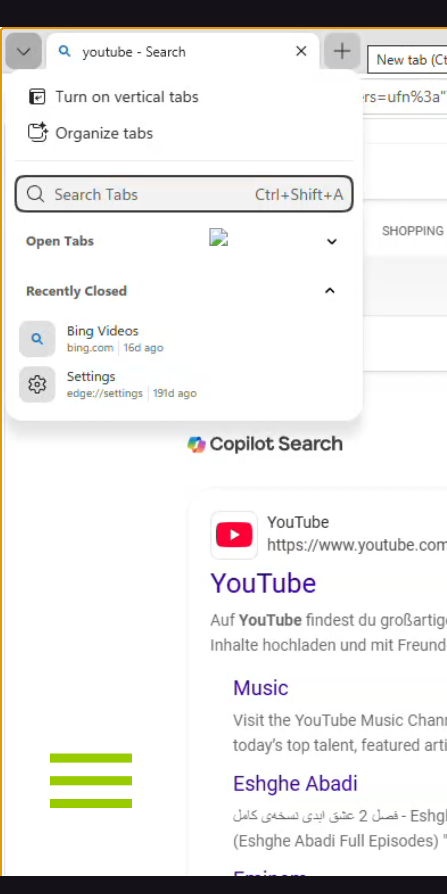
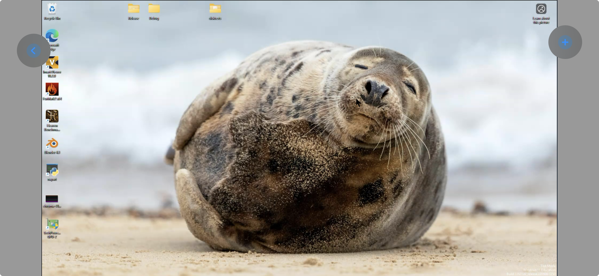

# OSVDI Remote Access - Evaluation Report

**Date:** 2026-05-11  
**Project:** OSVDI Remote Access Clients  
**Repositories:** SPICEViewerAndroid, spicemobile-ios  
**Author:** Bishwajeet Parhi

---

## 0. Terminology & Access Variants

The OSVDI project offers SPICE remote access via **three distinct client categories**:

| Term | What it means | Examples |
|------|---------------|---------|
| **Native client** | Standalone compiled application that implements the SPICE protocol directly using libspice-gtk. No browser component. Handles video decoding, rendering, and all SPICE channels natively. | `remote-viewer` (patched, on Linux/desktop), aSPICE / freeaSPICE (Android/iOS app stores) |
| **WebView wrapper** | Thin native mobile app that embeds a browser component (Android WebView / iOS WKWebView) to load the SPICE HTML5 web client. Adds touch-to-mouse bridging and overlay controls. | SPICEViewerAndroid, spicemobile-ios (this project) |
| **Browser (web client)** | The SPICE HTML5 client running directly in a desktop browser. No wrapper app — the browser IS the application. | `https://demo.osvdi.uni-freiburg.de` in Chrome/Firefox/Safari |

```
                    OSVDI Access Variants
                    =====================

    Native Client              WebView Wrapper              Browser
    ─────────────              ───────────────              ───────
    ┌─────────────┐       ┌───────────────────┐       ┌─────────────┐
    │ remote-viewer│       │ Android/iOS App   │       │ Chrome /    │
    │ aSPICE       │       │ ┌───────────────┐ │       │ Firefox /   │
    │              │       │ │ WebView       │ │       │ Safari      │
    │ libspice-gtk │       │ │ ┌───────────┐ │ │       │             │
    │ H264 decode  │       │ │ │ SPICE     │ │ │       │ SPICE HTML5 │
    │ All channels │       │ │ │ HTML5 +   │ │ │       │ Client      │
    │              │       │ │ │ JS bridges│ │ │       │             │
    └──────┬───────┘       │ │ └───────────┘ │ │       └──────┬──────┘
           │               │ └───────────────┘ │              │
           │               └────────┬──────────┘              │
           │                        │                         │
           ▼                        ▼                         ▼
    ┌─────────────────────────────────────────────────────────────┐
    │              QEMU/KVM VM (Remote Desktop)                    │
    │              via SPICE protocol (H264 + channels)            │
    └─────────────────────────────────────────────────────────────┘
```

The **native client** (`remote-viewer`) serves as the **ground truth baseline** for performance and feature completeness. It can be launched from the OSVDI web UI by clicking "native."


---


## 2. What's Working

| Feature | Android | iOS | Notes |
|---------|---------|-----|-------|
| WebView SPICE session loading | Working | Working | Both detect SPICE URLs, configure zoom/scrollbars |
| Touch-to-mouse emulation | Working | Working | Single-finger movement, JS bridge |
| Long-press drag | Working | Working | 400ms threshold |
| Two-finger right-click | Working | Working | 120ms immediate window |
| Virtual keyboard input | Working | Working | Hidden text field captures input |
| Backspace handling | Working | Working | Platform-specific interception |
| Floating overlay controls | Working | Working | Android: draggable. iOS: fixed position |
| Loading state indicator | Working | Working | Android: 555ms delay. iOS: spinner |
| Text selection blocking | Working | Working | Same JS (CSS + MutationObserver) |
| Landscape orientation lock | Working | Working | Forced for SPICE sessions |
| Product flavor builds | Working | Working | Both have bwLPRemote + OSVDIClient |
| Pinch-to-zoom | Broken | Partial | Android: TODO in code. iOS: 0.5x-1.0x only |

---

## 3. Observed Issues

### Android: Cropped Viewport & Missing Cursor — Critical



**Observed:** The remote desktop (Windows VM in Edge browser) is cropped on the right — content is cut off and inaccessible. No mouse cursor is visible anywhere on screen despite `touchToMouseScript.js` containing cursor overlay logic.

| Problem | Impact | Expected (industry standard) |
|---------|--------|------------------------------|
| Screen not scaled to device | Critical — portions of remote desktop unreachable | Fit-to-screen by default, pinch to zoom for detail |
| Mouse cursor missing | Critical — cannot see where you're pointing | Visible software cursor overlay tracking touch position |
| No back/home navigation button | High — user is trapped in the SPICE session with no way to go back | Back button or home icon to return to VM selection (iOS has this) |

### iOS: Taskbar Cut Off & Viewport Scaling — High



**Observed:** The remote Linux desktop is visible but the bottom taskbar is cut off. Gray bars appear on both left and right sides, indicating the content is not properly scaled to fill the device viewport. The overlay buttons (blue circles) are visible on the edges.

| Problem | Impact | Expected (industry standard) |
|---------|--------|------------------------------|
| Taskbar cropped at bottom | High — cannot access running apps, system tray, start menu | Full remote desktop visible within viewport |
| Gray bars on sides | Medium — wasted screen space | Content scaled to fill available area or user-configurable aspect ratio |

### iOS: Infinite Loading State — High


**Observed:** The app gets stuck on a "Loading..." spinner indefinitely in two scenarios:
1. **Back navigation** — pressing back from a SPICE session (flaky, doesn't always happen)
2. **Screen lock/unlock** — locking the device during a session and unlocking consistently triggers the infinite loading state

The user must force-quit and relaunch the app to recover. The WKWebView likely loses its connection or page state when the app is suspended during screen lock, and does not handle reloading gracefully.

| Problem | Impact | Expected (industry standard) |
|---------|--------|------------------------------|
| Infinite loading after back navigation | Medium — requires app restart | Graceful disconnect, return to VM selection |
| Infinite loading after screen lock/unlock | High — very common user action breaks the session | Session survives background/suspend, or auto-reconnect on resume |

### iOS: Forced Landscape Orientation — Medium

The app always launches in landscape mode with no option to switch to portrait. Users should be able to choose their preferred orientation — portrait can be useful for reading documents, vertical web pages, or mobile-first VM layouts. Competitors like TeamViewer and AnyDesk allow both orientations with the remote desktop adapting accordingly.

| Problem | Impact | Expected (industry standard) |
|---------|--------|------------------------------|
| Forced landscape, no portrait option | Medium — limits usability for vertical content | User choice between portrait and landscape, or auto-rotate support |

### Both Platforms: Tap Does Not Move Cursor — High

The cursor only moves when dragging/hovering a finger across the screen. Tapping a different location does **not** reposition the cursor there — it clicks at the cursor's current position instead. For example, if the cursor is on an icon and the user double-taps elsewhere on the screen, the double-click registers on the icon, not where the user tapped.

In industry apps with "direct touch" mode, tapping anywhere instantly moves the cursor there and clicks. The current behavior forces users to always drag to their target first, making every interaction slower and less intuitive.

| Problem | Impact | Expected (industry standard) |
|---------|--------|------------------------------|
| Tap doesn't reposition cursor | High — every click requires a drag to target first | Tap moves cursor to touch position and clicks there (direct touch mode) |

### Both Platforms: Missing Touch Gestures — High

| Gesture | Industry Standard | OSVDI Status |
|---------|-------------------|--------------|
| Two-finger pan (viewport scroll when zoomed) | Universal | Missing |
| Two-finger scroll (mouse wheel) | Universal | Missing |
| Pinch-to-zoom | Universal | Broken (Android), Partial (iOS) |
| Touch mode toggle (direct vs trackpad) | Universal | Missing |

### Both Platforms: Missing Modifier Keys — High

The overlay has only 3 buttons (home, keyboard, one action). No modifier keys (Ctrl, Alt, Shift, Esc, function keys). Users cannot perform Ctrl+C, Ctrl+V, Alt+Tab, Ctrl+Alt+Del, or use function keys.

Every competitor provides toggleable modifier keys in the toolbar or above the on-screen keyboard.

---

## 4. Accessibility & Touch UX Assessment

A detailed comparison with 6 industry-leading remote desktop apps (TeamViewer, AnyDesk, RustDesk, Microsoft RD Client, Chrome Remote Desktop, Citrix Workspace) is available in **[accessibility-evaluation.md](accessibility-evaluation.md)**.

### Scores by Tier

| Tier | OSVDI Android | OSVDI iOS | What it means |
|------|---------------|-----------|---------------|
| **MVP** (must-have) | 2 / 18 (11%) | 5 / 18 (28%) | App is usable for basic remote desktop |
| **Enhanced** (comfortable) | 8 / 18 (44%) | 10 / 18 (56%) | Productive for real daily work |
| **Premium** (competitive) | 0 / 14 (0%) | 0 / 14 (0%) | On par with TeamViewer / AnyDesk |
| **Overall** | **10 / 50 (20%)** | **15 / 50 (30%)** | |

Neither platform meets the MVP bar today. See Section 6 for the full tier breakdown and roadmap.

---

## 5. What's Missing (Feature Gaps)

### Critical Gaps (Both Platforms)

| Feature | Impact | Difficulty | Notes |
|---------|--------|-----------|-------|
| **Audio channel** (bidirectional) | Cannot use for conferencing/media | High | Native bridge or WebRTC required |
| **Clipboard/copy-paste** | Basic workflow broken | Medium | JS Clipboard API + native bridge |
| **File transfer** | Cannot move files to/from VM | High | SPICE channel or alternative |
| **USB redirection** | No local device access on VM | Very High | Fundamentally impossible via WebView |
| **Multi-monitor/desktop mode** | No external display support | High | Platform-specific display APIs |
| **Performance metrics overlay** | Cannot measure round-trip latency | Medium | Needed for evaluation |
| **Physical keyboard full support** | Modifier keys unreliable | Medium | Must intercept at native level |

### Platform-Specific Gaps

| Feature | Android | iOS |
|---------|---------|-----|
| Settings/preferences UI | Missing (hardcoded) | Partial (isTouchMode persists) |
| CI/CD pipeline | Working | Missing |
| Internationalization | 15 languages | English only |
| Pinch-to-zoom | Broken | Partial (0.5x-1.0x) |
| Haptic feedback | JS bridge, no handler | Fully implemented |
| OIDC auth detection | Basic URL matching | Explicit auth handling |
| Mac Catalyst | N/A | Not enabled |

---

## 6. Feature Tiers & MVP Definition

Features are categorized into three tiers. The **MVP** is the minimum bar for the app to be usable by any user — without these, the app is broken for basic remote desktop work.

### Tier 1: MVP (Must-Have) — "Users can actually use the remote desktop"

Without these, the app is not functional enough to ship. Every competing app has all of these.

| Feature | Android | iOS | Effort | Why MVP |
|---------|---------|-----|--------|---------|
| **Fit-to-screen scaling** | Missing — cropped | Partial — taskbar cut off | Medium | Cannot see the full remote desktop |
| **Visible mouse cursor** | Missing | Partial (JS overlay) | Low | Cannot see where you're pointing |
| **Tap repositions cursor** | Missing — must drag to target | Missing — must drag to target | Medium | Every tap requires a drag first, unusable |
| **Pinch-to-zoom** | Broken (TODO) | Partial (0.5x–1.0x) | Medium | Cannot read small text or click small buttons |
| **Two-finger pan when zoomed** | Missing | Missing | Medium | Zoom is useless without pan |
| **Modifier keys (Ctrl, Alt, Shift, Esc)** | Missing | Missing | Medium | Cannot copy/paste, switch windows, or use shortcuts |
| **Back/home navigation** | Missing — trapped in session | Working | Low | No way to exit SPICE session on Android |
| **Session survives screen lock** | N/A | Missing — infinite loading | Medium | Locking phone kills the session, requires force-quit |
| **Orientation choice** | Forced landscape | Forced landscape | Low | Cannot use portrait for vertical content |

**MVP score: Android 0/9, iOS 3/9** — neither platform meets the minimum usable bar today.

### Tier 2: Enhanced — "Users can work comfortably"

These make the app feel like a proper remote desktop tool, not a proof of concept. Expected by power users and anyone using the app for real work.

| Feature | Android | iOS | Effort | Why Enhanced |
|---------|---------|-----|--------|-------------|
| **Two-finger scroll** (mouse wheel) | Missing | Missing | Medium | Cannot scroll web pages or documents |
| **Touch mode toggle** (direct ↔ trackpad) | Missing | Missing | Medium | Power users need trackpad-style cursor control |
| **Function keys** (F1–F12, Esc) | Missing | Missing | Low | Needed for terminal, IDE, system shortcuts |
| **Clipboard/copy-paste** | Missing | Missing | Medium | Basic productivity workflow |
| **Haptic feedback** | JS bridge exists, no handler | Working | Low | Tactile confirmation of clicks and mode changes |
| **Settings/preferences UI** | Missing (hardcoded) | Partial | Low | Users need to configure cursor speed, default URL, etc. |
| **Zoom persistence** | N/A | N/A | Low | Zoom resets on keyboard show/hide |
| **Gesture help/onboarding** | Missing | Missing | Low | New users can't discover available gestures |
| **CI/CD pipeline** | Working | Missing | Low-Medium | iOS has no build automation |
| **Internationalization** | 15 languages | English only | Low | iOS unusable for non-English users |

### Tier 3: Premium — "Competitive with TeamViewer/AnyDesk"

Nice-to-have features that differentiate from competitors. Not needed for basic usability but add real value for specific use cases.

| Feature | Android | iOS | Effort | Why Premium |
|---------|---------|-----|--------|-------------|
| **Audio channel** (bidirectional) | Missing | Missing | High | Conferencing, media playback |
| **File transfer** | Missing | Missing | High | Move files to/from VM |
| **Three-finger middle click** | Missing | Missing | Low | Niche but useful for Linux power users |
| **Auto-keyboard on focus** | Missing | Missing | Medium | Detect editable fields, auto-show keyboard |
| **Remote cursor matching** | Missing | Missing | Medium | Show actual remote cursor shape (text, resize, etc.) |
| **Cursor size/speed adjust** | Missing | Missing | Low | Accessibility for users who need larger cursor |
| **Gesture customization** | Missing | Missing | Medium | Remap finger counts to different actions |
| **Multi-monitor/desktop mode** | Missing | Missing | High | External display, phone as trackpad |
| **Performance metrics overlay** | Missing | Missing | Medium | Show FPS, latency, codec info |
| **USB redirection** | Impossible via WebView | Impossible via WebView | Very High | Requires native SPICE client |
| **Printing** | Impossible via WebView | Impossible via WebView | Very High | Requires native SPICE client |
| **Native SPICE rendering** | Missing | Missing | Very High | Bypass WebView entirely for lower latency |

### MVP Roadmap

```
Phase 1: Make it usable (MVP)                    ~4-6 weeks
├── Fix screen scaling (fit-to-screen)
├── Fix cursor visibility (Android)
├── Tap repositions cursor (direct touch mode)
├── Fix pinch-to-zoom + add two-finger pan
├── Add modifier key bar (Ctrl, Alt, Shift, Esc)
├── Add back navigation button (Android)
├── Fix session survival on screen lock (iOS)
└── Allow portrait + landscape orientation

Phase 2: Make it comfortable (Enhanced)           ~4-6 weeks
├── Two-finger scroll (mouse wheel)
├── Touch mode toggle (direct ↔ trackpad)
├── Function keys (F1-F12)
├── Clipboard bridge (copy/paste)
├── Haptic handler (Android)
├── Settings UI
├── Gesture onboarding
└── iOS CI/CD + i18n

Phase 3: Make it competitive (Premium)            ongoing
├── Audio channel
├── File transfer
├── Performance overlay
├── Advanced cursor features
└── Evaluate native SPICE rendering
```

---

## 7. Comparison with Existing Solutions

### OSVDI Access Variants (Internal)

| Variant | Platform | Rendering | Channels | Status |
|---------|----------|-----------|----------|--------|
| **remote-viewer (patched)** | Linux (Debian) | Native (libspice-gtk) | Full (video, audio, USB, clipboard, printing) | Production — ground truth |
| **SPICE HTML5 in browser** | Any desktop browser | Browser canvas | Video only (patched H264), limited input | Working — rewrite in progress |
| **SPICEViewerAndroid** | Android | WebView (Chromium) | Video + touch/keyboard bridge | Working — significant UX gaps |
| **spicemobile-ios** | iOS (iPhone/iPad) | WebView (WKWebView) | Video + touch/keyboard bridge | Working — some UX gaps |


## 9. Risk Assessment

| Risk | Likelihood | Impact | Mitigation |
|------|-----------|--------|------------|
| WebView latency unacceptable for interactive use | Unknown (must measure) | High | Benchmark against native; have FFI fallback plan |
| SPICE HTML5 rewrite breaks injected JS bridges | High | Medium | Coordinate with colleague on API stability |
| Jumping to architecture decisions before evaluation | Medium | High | Complete evaluation matrix before proposing changes |
| USB/printing channels impossible via WebView | Certain | Medium | Document as limitation; native code required |
| Platform-specific keyboard/modifier behavior | High | Medium | Systematic testing matrix per platform |

---

## 10. Summary

### Current State

The OSVDI WebView wrapper apps are **functional but significantly behind industry standards** for mobile remote desktop UX. Critical issues include cropped/unscaled remote desktop viewport, missing mouse cursor (Android), broken zoom, and absent modifier keys.

Compared to industry leaders (TeamViewer, AnyDesk, RustDesk, MS RD Client, Chrome Remote Desktop, Citrix), the Android app scores **29%** and iOS scores **39%** on accessibility feature completeness.

### What Must Happen First

**Evaluate before architecting.** The first milestone is a comprehensive comparison of all access variants.

### Architecture Decisions Pending Evaluation

Architecture and cross-platform framework decisions are deferred until evaluation data exists. A detailed analysis of options (Flutter, KMP, Electron/Tauri, .NET MAUI, native rendering approaches) is available in **[cross-platform-strategy.md](cross-platform-strategy.md)**.

| If evaluation shows... | Then consider... |
|------------------------|------------------|
| WebView latency is acceptable (<80ms) | Unify via cross-platform framework; invest in channels |
| WebView latency is unacceptable | Invest in native rendering (FFI to libspice-gtk) |
| SPICE HTML5 rewrite is fast and complete | WebView approach becomes more viable |
| Keyboard/modifier handling broken in browsers | Must intercept at native level |
| Advanced channels required on mobile | Must go native for USB/printing |

### Key Insight

The native client (`remote-viewer`) already works and supports everything. The WebView wrappers need significant UX improvements to be usable for everyday remote desktop work. Whether the long-term path is improving the WebView wrappers or building native SPICE clients depends on **measured evaluation data**.

---

## Related Documents

- **[Accessibility & Touch UX Evaluation](accessibility-evaluation.md)** — detailed comparison with 6 industry apps, gesture mapping tables, gap analysis
- **[Cross-Platform Strategy](cross-platform-strategy.md)** — Flutter, KMP, native rendering options, migration paths